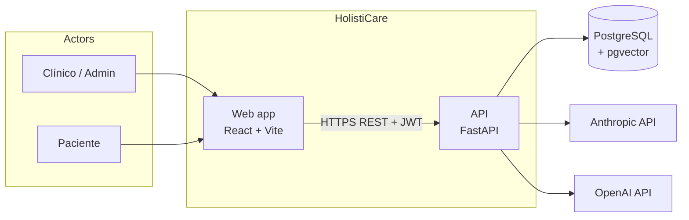
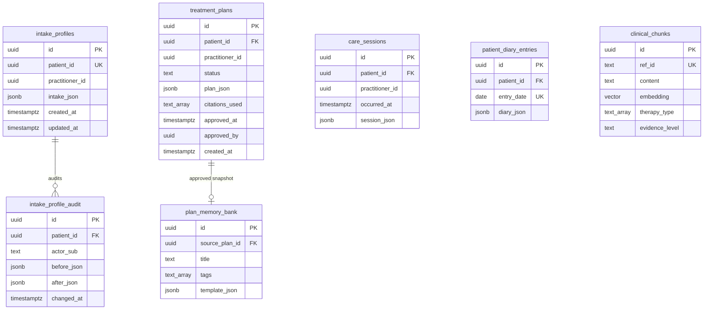

## Índice

0. [Ficha del proyecto](#0-ficha-del-proyecto)
1. [Descripción general del producto](#1-descripción-general-del-producto)
2. [Arquitectura del sistema](#2-arquitectura-del-sistema)
3. [Modelo de datos](#3-modelo-de-datos)
4. [Especificación de la API](#4-especificación-de-la-api)
5. [Historias de usuario](#5-historias-de-usuario)
6. [Tickets de trabajo](#6-tickets-de-trabajo)
7. [Pull requests](#7-pull-requests)

---

## 0. Ficha del proyecto

### **0.1. Tu nombre completo:**

Andrés Viveros

### **0.2. Nombre del proyecto:**

HolistiCare

### **0.3. Descripción breve del proyecto:**

Plataforma de apoyo a la decisión clínica para clínicas de rehabilitación holística e integrativa en México. Permite capturar perfiles de intake estructurados, generar borradores de planes de tratamiento multi-semana con RAG (recuperación de evidencia clínica + LLM), registrar sesiones y diario del paciente, analizar tendencias y detectar mesetas. Todo plan generado por IA requiere aprobación explícita del practicante (cumplimiento NOM-024-SSA3-2012).

### **0.4. URL del proyecto:**

> **Entorno demo (Render):** desplegar siguiendo `docs/deploy-entrega2-demo.md` y actualizar esta URL antes de enviar el Typeform.
>
> Ejemplo esperado:
> - Frontend: `https://holisticare-frontend.onrender.com`
> - API health: `https://holisticare-api.onrender.com/health`

### 0.5. URL o archivo comprimido del repositorio

Repositorio GitHub: [https://github.com/andresviverosw/holisticare](https://github.com/andresviverosw/holisticare)

Rama de Entrega 2: [https://github.com/andresviverosw/holisticare/tree/feature-entrega2-AVW](https://github.com/andresviverosw/holisticare/tree/feature-entrega2-AVW)

Documentación técnica extendida del proyecto original: `README-ORIGINAL.md` y carpeta `docs/`.

---

## 1. Descripción general del producto

### **1.1. Objetivo:**

HolistiCare resuelve la fragmentación del seguimiento en rehabilitación holística: pacientes que reciben acupuntura, fisioterapia, nutrición y apoyo psicoemocional suelen tener historial disperso y adaptación del tratamiento basada en intuición. La plataforma centraliza intake, planes asistidos por IA con citaciones verificables, registro de sesiones, diario del paciente y analítica de progreso. El valor principal es acelerar la elaboración de planes basados en evidencia sin eliminar el control clínico del practicante.

Usuarios objetivo:
- **Primarios:** clínicos (fisioterapeutas, naturopatas, médicos integrativos).
- **Secundarios:** pacientes ambulatorios (diario y seguimiento).
- **Terciarios:** administradores de clínica (ingesta de corpus clínico).

### **1.2. Características y funcionalidades principales:**

1. **Intake estructurado (`generic_holistic_v0`)** — formulario clínico con validación Pydantic, banderas de riesgo asistidas por LLM y auditoría de cambios.
2. **Generación de planes con RAG** — pipeline de cinco fases: resumen clínico → multi-query → recuperación pgvector → reranking → generación JSON con REF-IDs.
3. **Gobernanza clínica** — todo plan nace en `pending_review`; aprobación/rechazo obligatoria antes de activación (NOM-024).
4. **Ingesta de conocimiento** — PDF/HTML a chunks indexados con metadatos (terapia, condición, nivel de evidencia).
5. **Guardas de seguridad nutricional** — bloqueo de recomendaciones dietéticas que coinciden con contraindicaciones/alergias del intake.
6. **Sesiones y diario** — registro estructurado de sesiones, check-ins diarios del paciente (dolor, sueño, ánimo).
7. **Analítica y predicción** — tendencias de outcomes, detección de mesetas y recomendaciones de ajuste.
8. **Memory bank** — biblioteca de planes aprobados reutilizables como plantillas (US-PLAN-004).

### **1.3. Diseño y experiencia de usuario:**

Flujo principal del clínico:

1. **Login** — pantalla `/login` con botón “Entrar (desarrollo)” cuando `ALLOW_DEV_AUTH=true` (solo demo/staging).
2. **Dashboard** — UUID de paciente, formulario de intake, generación de plan, paneles de predicción y memory bank.
3. **Plan Review** — revisión del borrador generado, citaciones, aprobar/rechazar/editar.
4. **Chunks** — exploración del índice vectorial (admin/debug).

Stack UI: React 18 + Vite + Tailwind CSS. Rutas protegidas con JWT (`RequireClinician`).

Capturas / video: añadir en el PR de entrega o enlazar grabación del flujo demo (login → intake → generar plan → aprobar).

### **1.4. Instrucciones de instalación:**

**Prerrequisitos:** Docker Desktop, Python 3.12+, Node.js 20+.

```bash
# 1. Clonar y configurar entorno
git clone https://github.com/andresviverosw/holisticare.git
cd holisticare
cp .env.example .env
# Completar ANTHROPIC_API_KEY, OPENAI_API_KEY, SECRET_KEY en .env
# Para demo local: ALLOW_DEV_AUTH=true

# 2. Levantar stack completo
docker compose up -d --build

# 3. Verificar salud
curl http://localhost:8000/health
# Frontend: http://localhost:5173
# API docs: http://localhost:8000/docs

# 4. Ingesta inicial (corpus mock)
curl -X POST http://localhost:8000/rag/ingest \
  -H "Authorization: Bearer <token>" \
  -H "Content-Type: application/json" \
  -d '{"source_dir":"data/mock","force_reindex":false}'

# 5. Tests (sin Docker, CI-safe)
cd backend && pip install -r requirements.txt && pytest tests/ -q
cd ../frontend && npm ci && npm run lint && npm test && npm run build
```

Guía detallada: `docs/setup.md`. Checklist de demo: `docs/demo-smoke-checklist.md`.

**Despliegue demo (Entrega 2):** `docs/deploy-entrega2-demo.md` + `render.yaml`.

---

## 2. Arquitectura del Sistema

### **2.1. Diagrama de arquitectura:**

Arquitectura en capas: **SPA React** → **API FastAPI** → **PostgreSQL + pgvector** + **APIs externas** (Anthropic Claude, OpenAI embeddings). El pipeline RAG corre in-process en el backend (no microservicio separado). Patrón: **hexagonal simplificado** — rutas HTTP delgadas, lógica en `app/services/`, persistencia ORM, RAG en `app/rag/`.



**Beneficios:** despliegue simple (Docker Compose / Render), trazabilidad end-to-end del plan, tests con mocks de DB y pipeline. **Sacrificio:** el reranker cross-encoder y el pipeline RAG comparten CPU con la API; escala vertical antes de extraer workers.

### **2.2. Descripción de componentes principales:**

| Componente | Tecnología | Responsabilidad |
|------------|------------|-----------------|
| Frontend | React 18, Vite, Tailwind, axios | UI clínica, JWT en localStorage, proxy `/api` en dev |
| API | FastAPI, Pydantic v2, SQLAlchemy 2 async | Auth RBAC, orquestación de servicios, OpenAPI |
| RAG Pipeline | Python (`app/rag/pipeline.py`) | Query builder, retrieval, rerank, generation |
| Vector store | PostgreSQL 16 + pgvector + LlamaIndex PGVectorStore | Embeddings 1536-d, cosine similarity |
| Reranker | cross-encoder (MiniLM) o Cohere | Reduce top-K candidatos antes del LLM |
| LLM | Claude Sonnet (+ fallback OpenAI chat) | Resumen clínico y JSON del plan |
| Embeddings | OpenAI text-embedding-3-small | Indexación y búsqueda semántica |

### **2.3. Descripción de alto nivel del proyecto y estructura de ficheros**

```text
holisticare/
├── backend/
│   ├── app/
│   │   ├── api/          # rutas FastAPI (rag.py, auth.py, deps.py)
│   │   ├── core/         # config, database
│   │   ├── models/       # ORM SQLAlchemy
│   │   ├── schemas/      # Pydantic v0 (intake, diary, session)
│   │   ├── services/     # lógica de negocio async
│   │   └── rag/          # ingestion, retrieval, generation, pipeline
│   ├── tests/            # pytest (CI-safe con mocks)
│   └── data/mock/        # corpus sintético para demo
├── frontend/src/
│   ├── pages/            # Login, Dashboard, PlanReview, Chunks
│   ├── services/api.js   # cliente HTTP
│   └── context/          # AuthContext (JWT)
├── infra/init.sql        # DDL PostgreSQL + pgvector
├── docs/                 # arquitectura, user stories, sprints, deploy
├── docker-compose.yml
├── render.yaml           # blueprint Render (Entrega 2)
└── README.md             # este documento (formato LIDR)
```

### **2.4. Infraestructura y despliegue**

**Local:** Docker Compose (`db`, `backend`, `frontend`).

**Demo cloud (Entrega 2):** Render Blueprint (`render.yaml`):
- PostgreSQL 16 (extensión `vector` vía `infra/init.sql`)
- Web Service Docker (backend, puerto 8000)
- Static Site (frontend `npm run build`)

Variables críticas: `ANTHROPIC_API_KEY`, `OPENAI_API_KEY`, `SECRET_KEY`, `CORS_ORIGINS`, `ALLOW_DEV_AUTH=true` (solo demo).

Análisis de opciones futuras: `holisticare_deployment_analysis.md`.

### **2.5. Seguridad**

- **JWT HS256** con roles `clinician`, `admin`, `patient` (`require_roles` en `deps.py`).
- **`ALLOW_DEV_AUTH`** desactivado por defecto en producción; ruta `/auth/dev-login` no registrada si es `false`.
- **Gobernanza NOM-024:** planes con `requires_practitioner_review: true` y estado `pending_review` hasta aprobación.
- **Guardas nutricionales:** diccionario configurable de sinónimos; API no arranca si el JSON es inválido.
- **CORS** restringido a orígenes explícitos.
- **Datos sintéticos** en desarrollo; LFPDPPP documentado en `docs/03-data-dictionary-and-privacy-framework.md`.

### **2.6. Tests**

- **Backend:** ~40+ tests pytest con `AsyncMock` de sesión DB y overrides de pipeline RAG (`conftest.py`). Cubren generación de planes, ingesta, intake, diario, plateau, memory bank, auth dev-login, seguridad SQL en chunks.
- **Frontend:** Vitest (utilidades, intake builder, errores API) + ESLint + build de producción.
- **CI:** `.github/workflows/ci.yml` — pytest + lint + test + build en cada push/PR a `main`.
- **E2E:** Playwright (`npm run test:e2e`) con backend+frontend en ejecución.

---

## 3. Modelo de Datos

### **3.1. Diagrama del modelo de datos:**



> No existe tabla `patients`; `patient_id` (UUID) es clave transversal acordada en servicios y API.

### **3.2. Descripción de entidades principales:**

**`intake_profiles`** — Perfil holístico v0 por paciente (`patient_id` UNIQUE). `intake_json` almacena queja principal, condiciones, metas, contraindicaciones, outcomes baseline. Auditoría en `intake_profile_audit`.

**`treatment_plans`** — Plan multi-semana en JSONB. Estados: `pending_review`, `approved`, `rejected`, `active`. `citations_used` lista REF-IDs del corpus.

**`clinical_chunks`** — Fragmentos de evidencia clínica con embedding VECTOR(1536), índice IVFFlat cosine, metadatos de terapia/condición/idioma.

**`patient_diary_entries`** — Un registro por paciente por día (UNIQUE `patient_id + entry_date`).

**`plan_memory_bank`** — Plantillas de-identificadas de planes aprobados para reutilización (US-PLAN-004).

DDL completo: `infra/init.sql`.

---

## 4. Especificación de la API

Base path autenticado: `/rag` (JWT Bearer). Roles indicados por endpoint.

### Endpoint 1 — Generar plan de tratamiento

```yaml
POST /rag/plan/generate
Roles: clinician, admin
Body:
  patient_id: uuid
  intake_json: GenericHolisticIntakeV0
  available_therapies: string[]
  preferred_language: "es" | "en"
Response 200:
  plan_id, weeks[], citations[], status: pending_review
  requires_practitioner_review: true
  insufficient_evidence: false | true
```

Ejemplo request:

```json
{
  "patient_id": "11111111-1111-1111-1111-111111111111",
  "intake_json": {
    "profile_version": "generic_holistic_v0",
    "chief_complaint": "Dolor lumbar mecánico.",
    "conditions": ["lumbalgia subaguda"],
    "goals": ["Reducir dolor"]
  },
  "available_therapies": ["fisioterapia", "acupuntura"],
  "preferred_language": "es"
}
```

### Endpoint 2 — Persistir intake

```yaml
POST /rag/intake
Roles: clinician, admin
Body:
  patient_id: uuid
  intake_json: GenericHolisticIntakeV0
Response 200:
  id, patient_id, intake_json, created_at
```

### Endpoint 3 — Aprobar o rechazar plan

```yaml
PATCH /rag/plan/{plan_id}/approve
Roles: clinician, admin
Body:
  action: "approve" | "reject"
  practitioner_notes: string | null
  edited_plan_json: object | null
Response 200:
  id, status, approved_at, plan_json
```

Documentación interactiva (solo con `DEBUG=true`): `GET /docs`.

---

## 5. Historias de Usuario

**Historia de Usuario 1 — US-PLAN-001**

Como **clínico**, quiero **generar un borrador de plan multi-semana a partir del perfil del paciente y sus metas**, para **obtener un punto de partida basado en evidencia más rápido**.

Criterios de aceptación:
- Dado un intake válido `generic_holistic_v0`, cuando solicito generación, entonces recibo un plan estructurado en JSON con semanas y actividades.
- Dado chunks recuperados, cuando el LLM responde, entonces cada recomendación incluye REF-IDs citables.
- Dado sin evidencia suficiente, cuando no hay chunks, entonces recibo `insufficient_evidence: true` sin alucinar contenido clínico.
- El plan siempre nace en `pending_review`.

**Historia de Usuario 2 — US-INT-001**

Como **clínico**, quiero **completar un formulario de intake estructurado**, para **que los datos baseline del paciente sean completos y analizables**.

Criterios de aceptación:
- Campos requeridos bloquean envío con errores por campo.
- Intake persistido vía `POST /rag/intake` y recuperable con `GET /rag/intake/{patient_id}`.
- UI Dashboard permite construir JSON sin editar raw manualmente (US-INT-004).

**Historia de Usuario 3 — US-ANLY-002**

Como **clínico**, quiero **detectar mesetas y empeoramientos automáticamente**, para **intervenir antes en el tratamiento**.

Criterios de aceptación:
- Endpoint `GET /rag/analytics/patient/{id}/plateau-flags` devuelve flags con explicación.
- Dashboard muestra panel de predicción/recomendaciones cuando hay datos de diario.
- Tests de regresión en `test_plateau_service.py` y `test_plateau_api.py`.

---

## 6. Tickets de Trabajo

**Ticket 1 — Backend: Pipeline RAG y generación de plan (Sprint 1)**

- **ID:** Sprint 1 / US-PLAN-001
- **Alcance:** Implementar `POST /rag/plan/generate`, wiring de QueryBuilder → VectorRetriever → Reranker → PlanGenerator, persistencia en `treatment_plans`, respuesta `insufficient_evidence`, tests pytest.
- **DoD:** pytest verde; plan JSON validado; status `pending_review`; citaciones REF-ID.
- **Evidencia:** `backend/tests/test_rag.py`, `test_plan_generate_api.py`, `test_pipeline_insufficient.py`.

**Ticket 2 — Frontend: Dashboard intake + generación (Sprint 9)**

- **ID:** US-INT-004, US-INT-005
- **Alcance:** Formulario intake en Dashboard, generación UUID v4, selección de paciente reciente, llamadas a `saveIntake` y `generatePlan`, manejo de errores API en español.
- **DoD:** lint + vitest + build verdes; flujo manual login → intake → generar plan.
- **Evidencia:** `frontend/src/pages/Dashboard.jsx`, `utils/intakeBuilder.test.js`.

**Ticket 3 — Base de datos: Memory bank de planes aprobados (Sprint 10)**

- **ID:** US-PLAN-004
- **Alcance:** Tabla `plan_memory_bank`, ORM, patch SQL idempotente, endpoints add/list/instantiate, sanitización sin `patient_id` en plantillas.
- **DoD:** migración aplicable en volúmenes existentes; tests API y servicio verdes.
- **Evidencia:** `infra/patch_plan_memory_bank.sql`, `test_plan_memory_bank_service.py`, `test_plan_memory_bank_api.py`.

---

## 7. Pull Requests

**Pull Request 1**

- **URL:** [https://github.com/andresviverosw/holisticare/pull/1](https://github.com/andresviverosw/holisticare/pull/1)
- **Título:** Implement US-RAG-003 nutrition guidance end-to-end with safety guards
- **Historia:** US-RAG-003
- **Resumen:** Ingesta y retrieval de evidencia nutricional; guardas de seguridad contra contraindicaciones del intake.

**Pull Request 2**

- **URL:** [https://github.com/andresviverosw/holisticare/pull/2](https://github.com/andresviverosw/holisticare/pull/2)
- **Título:** Feat/us rag 003 nutrition guidance
- **Historia:** US-RAG-003 (refinamiento)
- **Resumen:** Ajustes finales del flujo nutricional y revisión en UI.

**Pull Request 3**

- **URL:** *(PR de Entrega 2 — crear al mergear `feature-entrega2-AVW` → `main`)*
- **Título:** feat: Entrega 2 LIDR — documentación académica, deploy demo y MVP ejecutable
- **Alcance:** README formato LIDR, `prompts.md`, `render.yaml`, guía de despliegue, soporte `VITE_API_BASE_URL` para frontend en producción.
