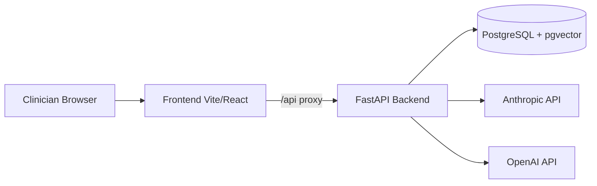
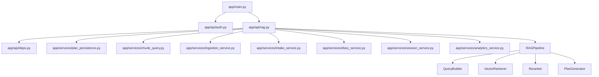
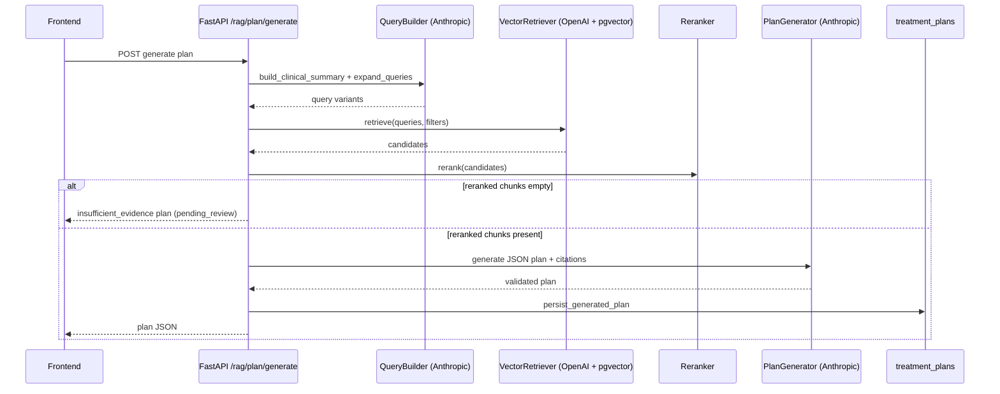

# Developer Guide and Architecture

## Purpose

This document describes the current implementation architecture, local workflows, and key integration points for contributors.

## Runtime architecture

## Backend architecture (modules)

## RAG pipeline (current behavior)

## Frontend architecture

- Router is defined in `frontend/src/App.jsx`.
- `AuthProvider` stores JWT in local storage (`holisticare_token`) and injects `Authorization` in axios interceptor.
- `RequireClinician` gates private routes by authentication presence.
- `formatApiError` (`frontend/src/utils/apiErrors.js`) centralizes HTTP error formatting for UI.

## Key API surfaces

- Public:
  - `GET /health`
  - `POST /auth/dev-login` (registered only when `ALLOW_DEV_AUTH=true`; otherwise the path returns 404)
- Authenticated:
  - Plan generation/review/sources: `/rag/plan/*`
  - Intake APIs: `/rag/intake*`
  - Sessions/diary/analytics
  - Ingestion: `/rag/ingest` (admin)
  - Chunk browse: `/rag/chunks`

## Environment variables (core)

From `app/core/config.py`:
- DB: `POSTGRES_USER`, `POSTGRES_PASSWORD`, `POSTGRES_DB`, `POSTGRES_HOST`, `POSTGRES_PORT`
- LLM: `ANTHROPIC_API_KEY`, `CLAUDE_MODEL`
- Embeddings: `OPENAI_API_KEY`, `EMBEDDING_MODEL`, `EMBEDDING_DIMS`
- Auth/App: `SECRET_KEY`, `ALLOW_DEV_AUTH`, `DEBUG`, `CORS_ORIGINS`

## Local developer workflow

1. Start stack:
   - `docker compose up -d --build`
2. Backend tests:
   - `python -m pytest -q`
3. Frontend checks:
   - `cd frontend`
   - `npm run lint`
   - `npm run test`
   - `npm run build`
4. API smoke:
   - from repo root: `npm run smoke:api`

## CI workflow

Defined in `.github/workflows/ci.yml`:
- `backend-tests`: installs backend deps and runs pytest.
- `frontend-checks`: runs `npm ci`, lint, unit tests, and production build.

## Current design notes

- **RAG ingestion** (`/rag/ingest`) indexes **`.pdf`**, **`.html`**, and **`.htm`** from the configured `source_dir`. PDFs may use native text or OCR fallback for scanned pages; HTML uses stripped visible text only (see `app/rag/ingestion/loader.py` and `html_reader.py`). OCR and hybrid PDF replacement do not apply to HTML.
- Plan generation returns practitioner-governed output (`pending_review`, `requires_practitioner_review=true`).
- Provider/model failures are mapped to explicit `502/503` responses with user-facing details.
- Retrieval is aligned with current LlamaIndex `PGVectorStore.query(VectorStoreQuery)` API and uses parallel similarity arrays.

