# Solution diagrams (HolistiCare)

This page collects **Mermaid** diagrams for the running system: context, data, components, and flows. They render in GitHub, many IDEs (including Cursor/VS Code with a Mermaid preview), and static site generators.

For environment variables and local commands, see `setup.md`. For module-level notes, see `08-developer-guide-and-architecture.md`.

---

## 1. System context (C4 Level 1)

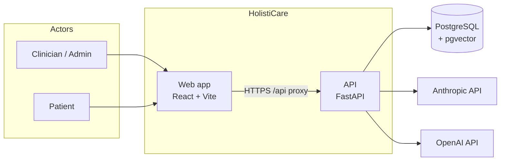

---

## 2. Containers (C4 Level 2)

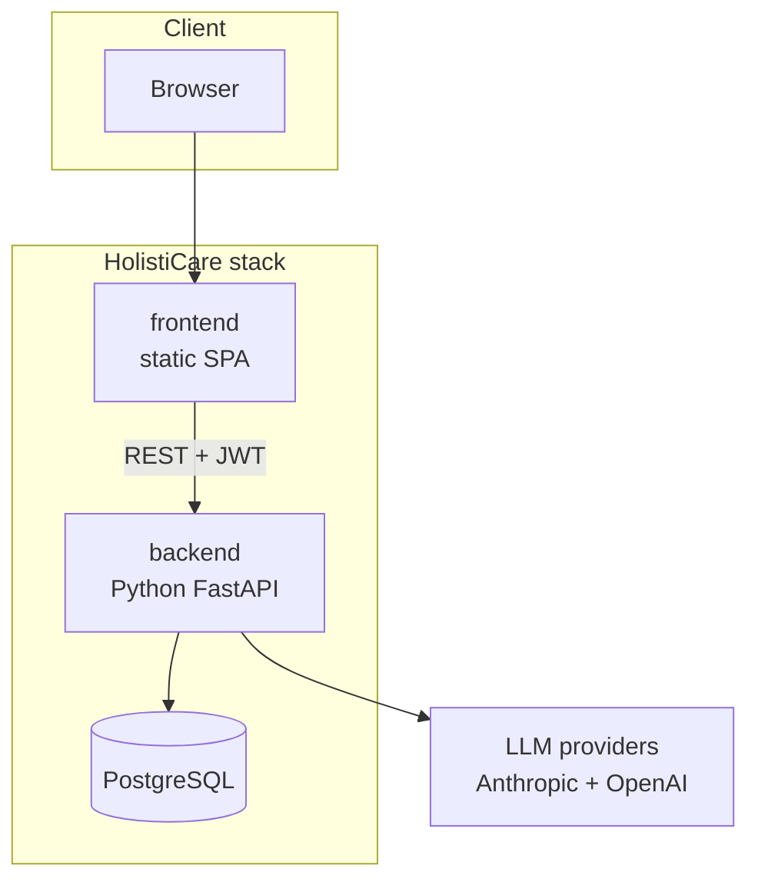

---

## 3. Logical entity relationship (application tables)

**Note:** There is no physical `patients` row store; `patient_id` (UUID) is the cross-cutting key. The diagram uses a **logical** `Patient` node for clarity. ORM models do not declare SQLAlchemy `relationship()` FK graphs for all pairs—associations are enforced in services and API contracts.

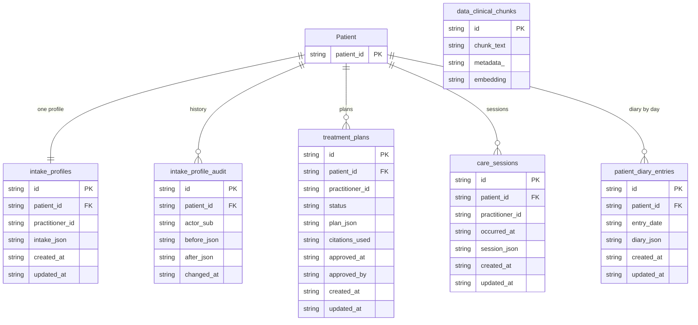

**Corpus:** `data_clinical_chunks` is managed by LlamaIndex `PGVectorStore` (ingestion pipeline). The physical column for chunk body is typically named `text` in PGVectorStore; the ER diagram uses `chunk_text` for readability. This table is **not** keyed by `patient_id`; retrieval binds evidence to a patient only at **query time** via the RAG pipeline (intake + goals → queries → chunks). No edge from `Patient` to `data_clinical_chunks` in the database.

---

## 4. Backend components (API → services → RAG)

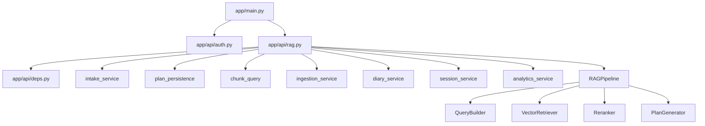

---

## 5. RAG pipeline (UML-style composition)

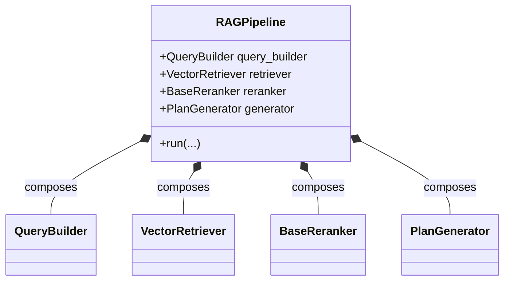

---

## 6. Frontend routes (high level)

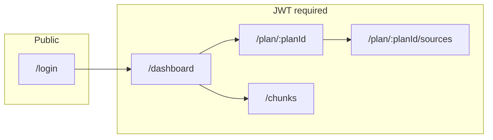

---

## 7. Flow: intake → draft plan generation

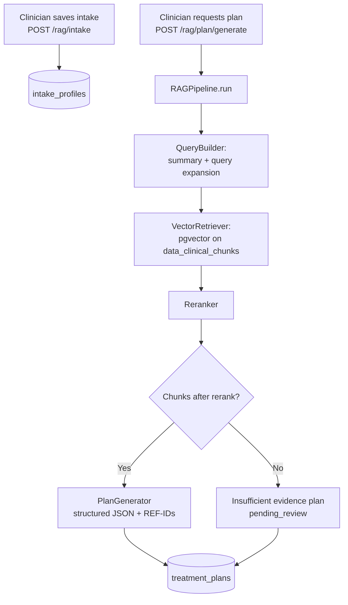

---

## 8. Flow: plan review and approval

```mermaid
flowchart TD
  A[Draft plan\nstatus pending_review] --> B[Clinician opens\nGET /rag/plan/{id}]
  B --> C{Decision}
  C -->|Approve| D[PATCH .../approve\naction=approve]
  C -->|Reject| E[PATCH .../approve\naction=reject + reason]
  D --> F[status approved]
  E --> G[status rejected]
```

---

## 9. Flow: corpus ingestion (admin)

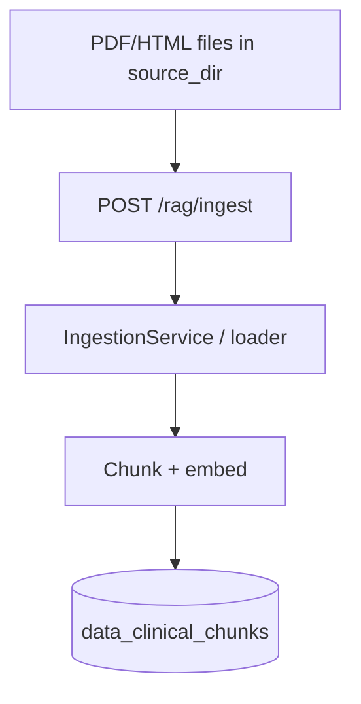

---

## 10. Flow: diary and analytics

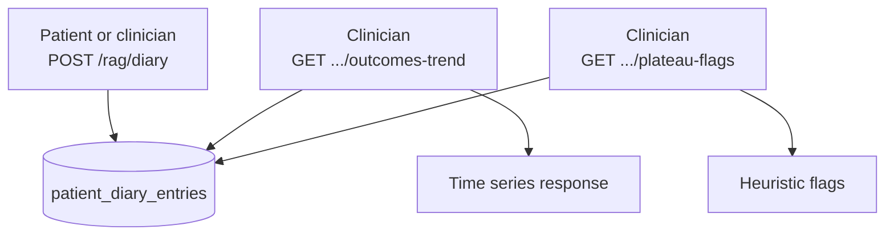

---

## 11. Sequence: plan generation (detail)

Same end-to-end as `08-developer-guide-and-architecture.md` (RAG pipeline sequence). Summary:

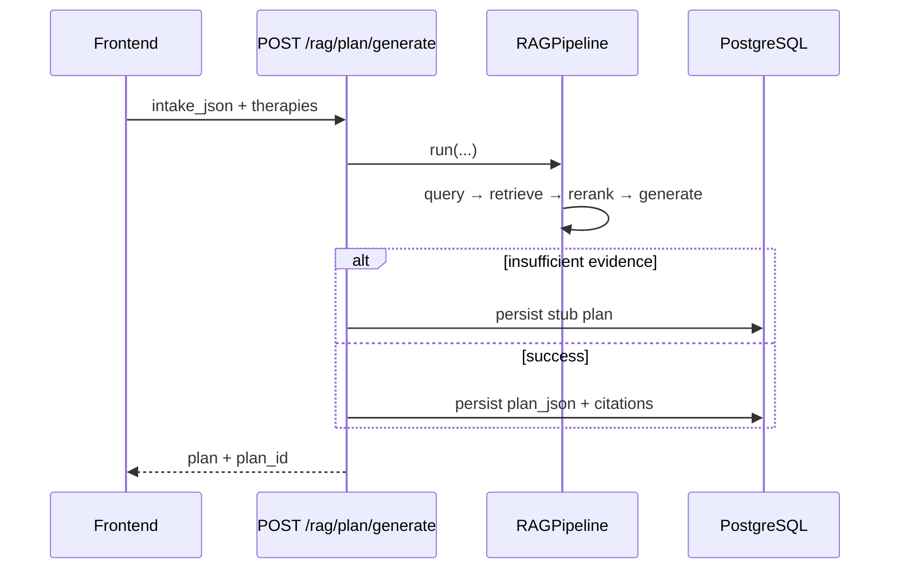

---

## 12. State: treatment plan status

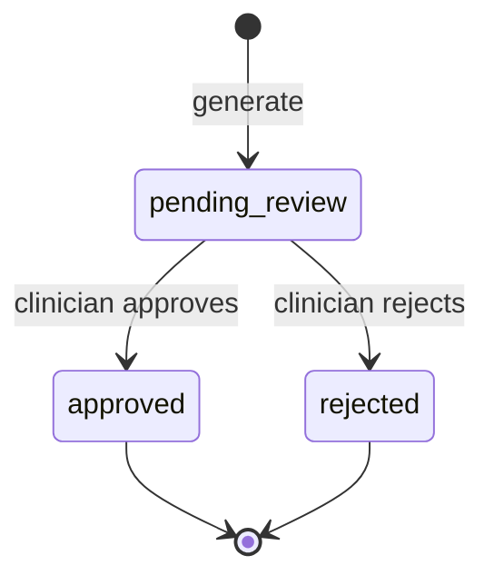

---

## Maintenance

- When adding tables or endpoints, update the **ER** and **flow** sections here and the narrative in `08-developer-guide-and-architecture.md`.
- Prefer Mermaid over binary images so diagrams **diff** cleanly in PRs.
