# HolistiCare — Documento de entrega final (capstone AI4devs)

| Campo | Valor |
|-------|--------|
| Producto | HolistiCare — apoyo a decisiones clínicas con IA para rehabilitación holística |
| Autor | Andrés Viveros |
| Programa | AI4devs (máster) |
| Versión del sistema | v0.1.0 — MVP clínico |
| Fecha del documento | 2026-07-26 |
| Demo pública (SPA) | https://holisticare-frontend.onrender.com |
| Demo pública (API) | https://holisticare-api.onrender.com |
| Repositorio | https://github.com/andresviverosw/holisticare |

---

## 1. Resumen ejecutivo

HolistiCare es una plataforma de **apoyo a la decisión clínica** diseñada para clínicas de rehabilitación holística en México. Integra:

1. **Intake estructurado** y banderas de riesgo.
2. **Planes de tratamiento multi-semana** generados con **RAG** (Retrieval-Augmented Generation) a partir de un corpus clínico indexado.
3. **Gobernanza NOM-024**: todo plan IA queda en `pending_review` y **requiere aprobación explícita** del practicante (sin auto-activación).
4. **Continuidad de cuidado**: diario del paciente, sesiones clínicas, analítica de progreso, predicción de trayectoria y recomendaciones.
5. **Privacidad**: anonimización/pseudonimización antes de llamadas a LLMs externos (**US-PRIV-001**).
6. **Operación demo**: despliegue público en **Render**, CI/CD gated, datos 100 % sintéticos.

Este documento consolida **qué se construyó a lo largo de los sprints 1–16**, la **arquitectura por capas**, el **stack tecnológico**, las **capacidades** (frontend clínico y paciente, backend, DB, RAG, CI/CD, corpus, sintéticos, seguridad y compliance) y **evidencia visual** del producto en producción.

---

## 2. Problema y propuesta de valor

### 2.1 Problema

En rehabilitación multimodal (fisioterapia, acupuntura, nutrición, mindfulness, etc.) el seguimiento suele fragmentarse entre Excel, WhatsApp y notas no estructuradas. Eso debilita:

- Continuidad entre sesiones.
- Personalización longitudinal.
- Medición objetiva de outcomes.

### 2.2 Propuesta

HolistiCare ofrece un ciclo cerrado:

**Intake → evidencia RAG → borrador de plan → revisión humana → sesiones + diario → analítica / predicción → ajuste.**

El clínico mantiene el control terapéutico; la IA acelera documentación y sugiere, no decide sola.

---

## 3. Alcance de esta entrega (features implementadas)

### 3.1 Capacidades de producto (vista clínica)

| Capacidad | Historias | Estado |
|-----------|-----------|--------|
| Intake estructurado `generic_holistic_v0` + guardar/cargar | US-INT-001, US-INT-004 | Done |
| Banderas de riesgo / contraindicaciones | US-INT-002 (+ UI Sprint 11) | Done |
| UUID de paciente, recientes, invitación diario | US-INT-005, US-DIARY-AUTH-PROD | Done |
| Generación de plan RAG con citas REF-ID | US-PLAN-001, US-PLAN-002 | Done |
| Aprobación / rechazo de plan (NOM-024) | US-PLAN-003 | Done |
| Memory bank de planes aprobados (plantillas) | US-PLAN-004 | Done |
| Ingesta corpus PDF/HTML + browse de chunks | US-RAG-001…003 | Done |
| Guardas de seguridad nutricional configurables | US-RAG-004 | Done |
| Diario proxy (clínico) y diario paciente | US-DIARY-001/002, UI, US-DIARY-UI-PATIENT | Done |
| Sesiones + sugerencia de nota IA | US-SESS-001/002 + UI | Done |
| Tendencias + mesetas (gráfico + proyección) | US-ANLY-001/002 + UI | Done |
| Trayectoria y recomendaciones | US-PRED-001/002 | Done |
| Auth clínico password + seed | US-AUTH-CLINICIAN-PROD | Done |
| Compose prod + Caddy | US-OPS-PROD-COMPOSE | Done |
| Anonimización LLM egress | US-PRIV-001 | Done |
| SPA con `VITE_API_BASE_URL` + Render | US-OPS-SPA-HOST, DEPLOY-01 | Done |

### 3.2 Capacidades de producto (vista paciente)

| Capacidad | Historias | Estado |
|-----------|-----------|--------|
| Login por invitación single-use → JWT paciente | US-DIARY-AUTH-PROD | Done |
| Login desarrollo por UUID (demo) | Sprint 12/13 | Done |
| Check-in diario dolor/sueño/ánimo/función + notas | US-DIARY-UI-PATIENT | Done |
| Historial reciente de check-ins | US-DIARY-UI-PATIENT | Done |

### 3.3 Fuera de alcance (explícito en plan final)

- App móvil nativa (R4 / `US-MOB-*`).
- IdP / MFA / reset de password / refresh tokens endurecidos.
- Portal ARCO completo (política documentada; UI diferida).
- Auto-activación de planes (prohibido por NOM-024).

---

## 4. Recorrido por sprints (1–16)

| Sprint | Enfoque | Entregables clave |
|--------|---------|-------------------|
| **1** | Plan IA | `POST /rag/plan/generate`, citas REF-ID, `pending_review` |
| **2** | Intake | Persistencia intake, risk flags, audit trail |
| **3** | Sesiones | Logging estructurado de intervenciones |
| **4** | Diario | Check-ins diarios `patient_diary_v0` |
| **5** | Analítica | Outcomes trend |
| **6** | Analítica | Plateau / worsening flags |
| **7** | RAG nutrición | Corpus eat/avoid + citas |
| **8** | Safety | Diccionario de sinónimos nutricionales configurable |
| **9** | UX intake | Nuevo paciente UUID, recientes |
| **10** | Memory bank | Plantillas desde planes aprobados desidentificados |
| **11** | UI continuidad | Dashboard: diary, progress, sessions, risk flags |
| **12** | Paciente | `/diario` con JWT paciente |
| **13** | Auth paciente | Invitaciones single-use |
| **14** | Auth clínico | Username/password + seed |
| **15** | Ops | `docker-compose.prod.yml` + Caddy |
| **16** | Cierre | US-PRIV-001, SPA host, Render público, eval/docs, CD |

Complementos post-sprint 15/16: dataset sintético v1 (SYNTH-01), ancla de ventana analítica a última fecha de diario, gráficos de progreso + proyección, CI-gated CD a Render.

---

## 5. Arquitectura a alto nivel

### 5.1 Contexto (C4 L1)

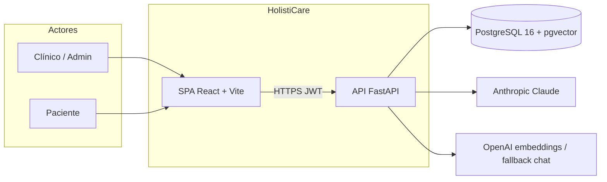

### 5.2 Contenedores (C4 L2) — topología demo Render

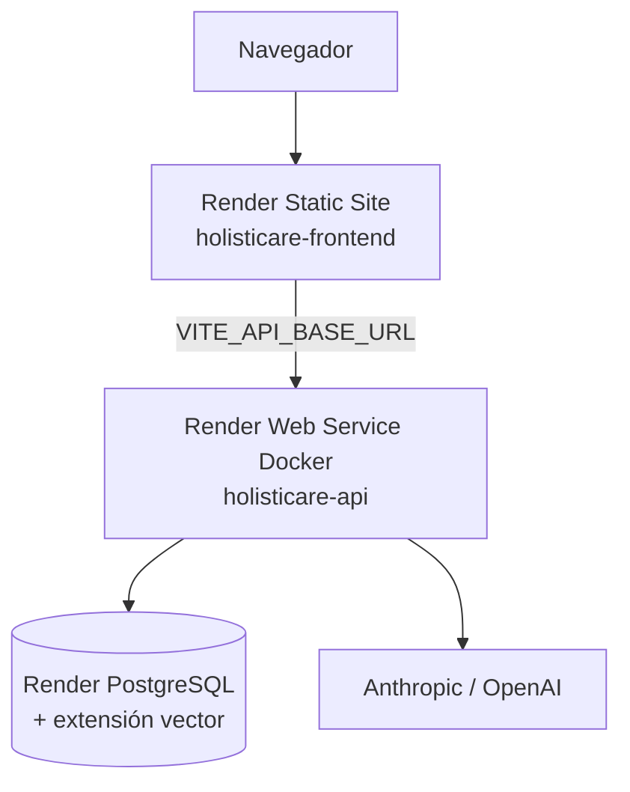

### 5.3 Capas de software (backend)

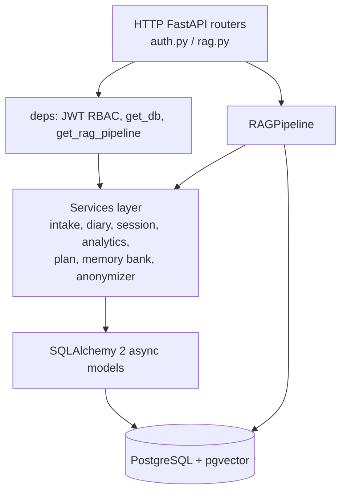

### 5.4 Pipeline RAG (5 fases)

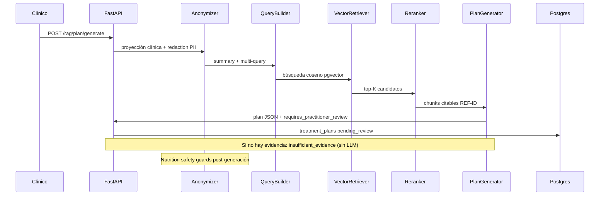

### 5.5 Modelo de datos lógico

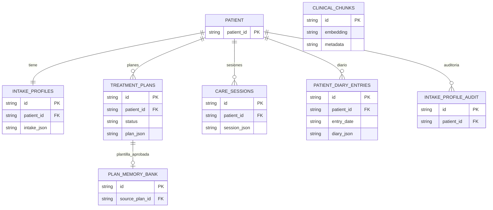

> No existe tabla física `patients`: el `patient_id` UUID es la clave transversal. El corpus (`clinical_chunks`) no se liga a pacientes en DB; el vínculo ocurre en tiempo de consulta vía el pipeline.

### 5.6 Frontend — rutas

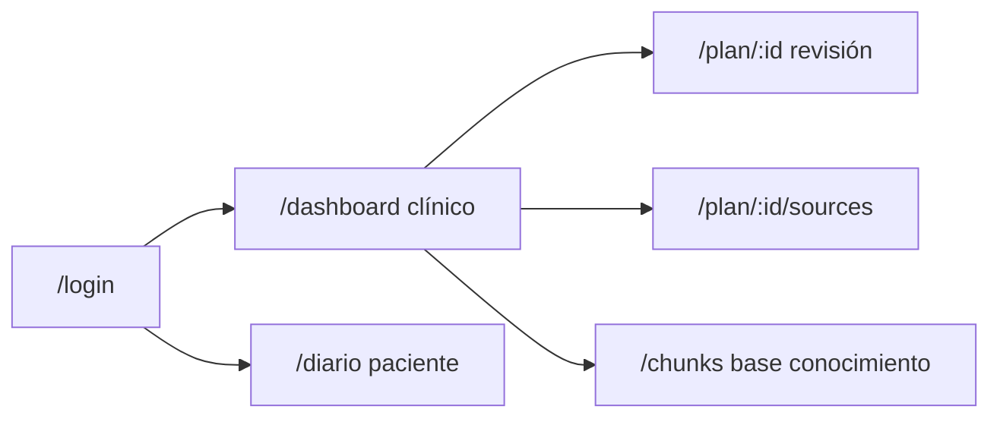

### 5.7 CI/CD

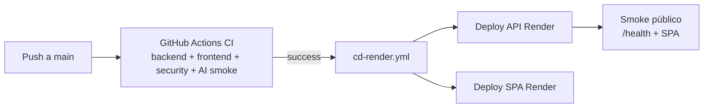

Render `autoDeploy` está **apagado**: solo se despliega tras CI verde (secret `RENDER_API_KEY`).

---

## 6. Tech stack (estado real del repo)

| Capa | Tecnología |
|------|------------|
| Frontend | React 19, Vite 8, Tailwind 3, React Router 8 |
| Backend | Python 3, FastAPI, SQLAlchemy 2 async, asyncpg, Pydantic / pydantic-settings |
| DB | PostgreSQL 16 + **pgvector** |
| RAG | Pipeline propio (`app/rag/`), LlamaIndex PGVectorStore en ingesta, embeddings OpenAI `text-embedding-3-small` |
| LLM | Claude (primario) + fallback OpenAI chat opcional |
| Rerank | Cross-encoder local o Cohere (configurable) |
| Auth | JWT HS256 (`sub` + `role`: clinician / admin / patient) |
| Contenedores | Docker Compose (dev + prod overlay), Dockerfile backend |
| Hosting demo | Render (API Docker + Static Site + Postgres) |
| CI | GitHub Actions: pytest, Vitest, ESLint, Playwright, pip-audit, bandit, npm audit, AI quality smoke |
| CD | Workflow `cd-render.yml` + script Python de deploy |

---

## 7. Capacidades por dominio

### 7.1 Frontend clínico

- Dashboard unificado: paciente, memory bank, diario proxy, progreso (SVG multi-KPI + proyección 4 semanas), sesiones, predicción, recomendaciones, intake, generar plan.
- Revisión de plan con approve/reject y fuentes.
- Base de conocimiento: listado filtrable de chunks (terapia, idioma, contraindicaciones).

### 7.2 Frontend paciente

- `/diario`: check-in 0–10 (dolor, sueño, ánimo, función), notas, historial.
- Acceso por invitación o modo desarrollo (demo).

### 7.3 Backend / API

- Router clínico concentrado en `/rag/*` + `/auth/*`.
- Servicios async puros (SOLID/D: deps inyectadas).
- Schemas versionados (`*_v0`) separados de ORM.

### 7.4 Base de datos

Tablas clave: `intake_profiles`, `intake_profile_audit`, `treatment_plans`, `care_sessions`, `patient_diary_entries`, `plan_memory_bank`, `clinical_chunks` (pgvector), `app_users`, invitaciones de diario.

### 7.5 RAG y corpus

- Ingesta admin-gated de PDF/HTML (OCR híbrido opcional).
- `ref_id` determinista; skip si ya indexado salvo `force_reindex`.
- Generación con citas; plan vacío estructurado si `insufficient_evidence`.
- Guardas nutricionales por términos/sinónimos configurables.

### 7.6 Datos sintéticos (SYNTH-01)

- Paquete v1: **32 pacientes** (8 arquetipos × 4 trayectorias), ~1194 diarios, sesiones, planes, memory bank.
- Cohortses: `improving`, `high_pain_plateau`, `worsening`, `short_series`.
- Seed en Render demo; IDs UUID v5 documentados en ops notes.
- **Ningún dato de paciente real** en desarrollo ni demo.

### 7.7 Seguridad y compliance

| Control | Implementación |
|---------|----------------|
| NOM-024 gate | `requires_practitioner_review: true`, status `pending_review` |
| LFPDPPP / minimización | US-PRIV-001 choke point antes de LLM; proyección clínica + redaction email/tel/UUID |
| RBAC | `require_roles`; paciente solo su `sub` |
| Auth prod | Password clínico hasheado; invitaciones paciente single-use con `exp` |
| Dev auth | `ALLOW_DEV_AUTH` (demo Render = true; prod compose = false) |
| Auditoría intake | `intake_profile_audit` |
| Scans CI | bandit, pip-audit, npm audit |

### 7.8 Observabilidad / calidad

- Tests unitarios/API backend (sin Docker en CI estándar).
- Vitest + Playwright E2E frontend.
- AI quality smoke con corpus CI.
- Informe RAG: `docs/rag-evaluation-report.md`.
- Waiver feedback clínico sintético: `docs/feedback-01-synthetic-demo-waiver.md`.

---

## 8. Flujos de usuario principales

1. **Clínico** inicia sesión → carga paciente sintético → revisa intake/riesgos → genera o reutiliza plantilla → aprueba plan.
2. **Clínico** invita al diario / el paciente registra check-ins.
3. **Clínico** ve gráfico de progreso + proyección, mesetas, trayectoria y recomendaciones.
4. **Clínico** registra sesión (opcionalmente con nota sugerida por IA).
5. **Admin** ingiere corpus; clínico consulta chunks.

---

## 9. Evidencia visual (capturas del demo público)

Capturas tomadas el 2026-07-26 contra https://holisticare-frontend.onrender.com con paciente sintético *improving* `be2ecd39-2ac6-5a8b-84af-b22f8fa7a4a8`.

### 9.1 Login (clínico y paciente)

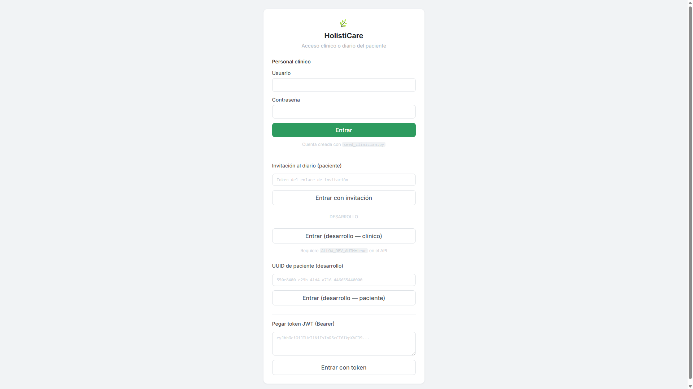

### 9.2 Dashboard clínico — paciente, plantillas e identificación

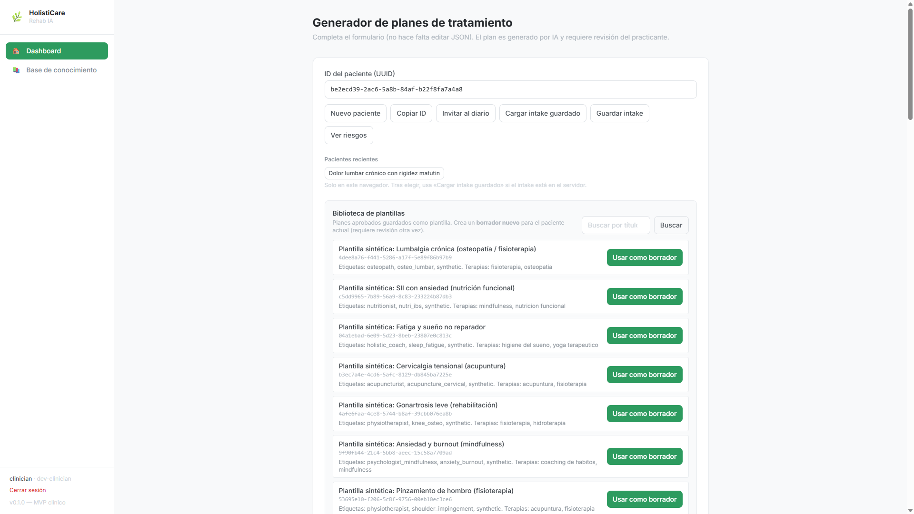

### 9.3 Progreso — gráfico multi-KPI + proyección de dolor 4 semanas

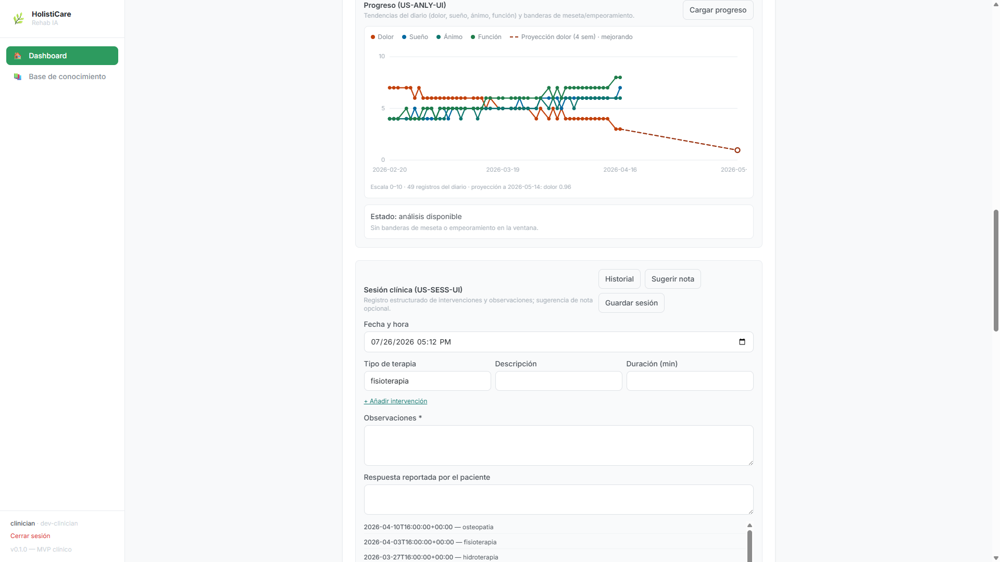

### 9.4 Predicción y recomendaciones + intake / risk flags

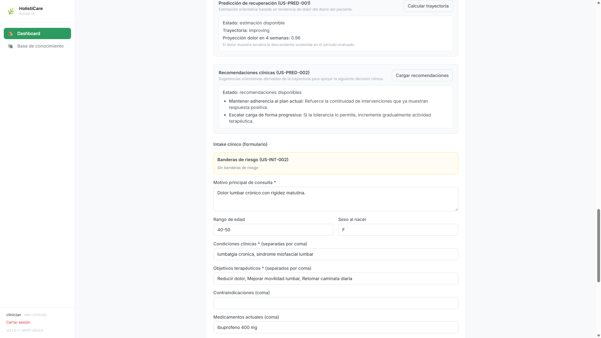

### 9.5 Base de conocimiento (chunks pgvector)

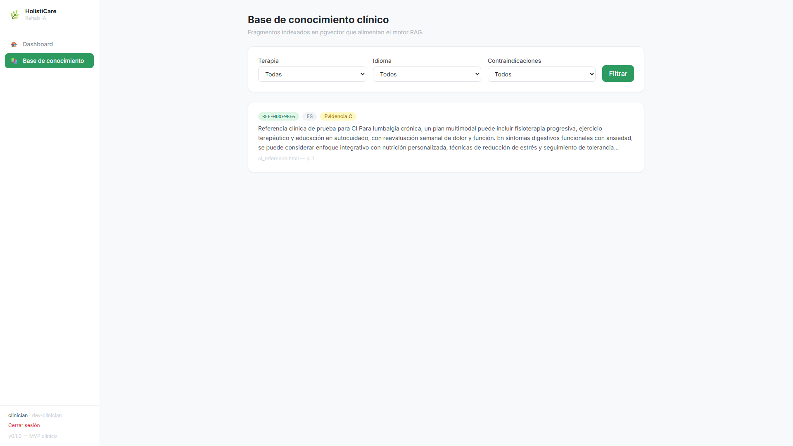

### 9.6 Vista paciente — Mi diario

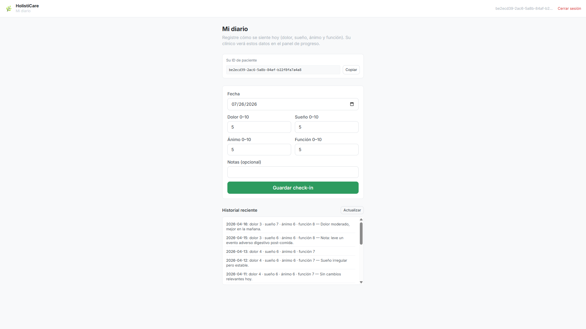

---

## 10. Cómo demostrar (smoke checklist)

1. Abrir SPA → **Entrar (desarrollo — clínico)** o usuario `clinician` / password demo documentada en ops.
2. Pegar UUID improving → verificar intake, diario, gráfico con proyección, trayectoria `improving`.
3. Abrir **Base de conocimiento** → ver fragmentos REF-*.
4. Cerrar sesión → login paciente (UUID desarrollo) → `/diario` con historial.
5. API: `GET https://holisticare-api.onrender.com/health` → 200 (cold start posible ~50s en free tier).

---

## 11. Empaquetado académico

| Artefacto | Ruta |
|-----------|------|
| Este documento | `docs/entrega-final-capstone.md` |
| Arquitectura detallada | `docs/02-system-architecture.md`, `docs/10-solution-diagrams.md` |
| Privacidad / diccionario | `docs/03-data-dictionary-and-privacy-framework.md` |
| Backlog / stories | `docs/04-feature-specs-and-user-stories.md` |
| Test plan | `docs/05-test-plan.md` |
| Deploy final | `docs/deploy-final-demo.md` |
| Eval RAG | `docs/rag-evaluation-report.md` |
| Dataset sintético | `docs/synthetic-dataset-v1.md` |
| Plan de entrega | `docs/final-delivery-plan.md` |

### Generar PDF

Desde la raíz del repo (requiere Node 22+):

```bash
node docs/scripts/build-entrega-pdf.mjs
```

Salida: `docs/entrega-final-capstone.pdf`.

El script renderiza Markdown + diagramas Mermaid en Chromium (Playwright) y exporta PDF A4.

---

## 12. Conclusión

La entrega cubre el **MVP clínico end-to-end** exigido por el capstone: RAG con gobernanza humana, continuidad diario/sesiones/analítica, predicción orientativa, privacidad en egress LLM, datos sintéticos, y **demo pública** con CI/CD. Los sprints 1–16 construyeron de forma incremental backend → UI → auth prod → ops → cierre de privacidad y despliegue.

HolistiCare queda listo como **ancla de portafolio** en health-tech mexicano y como entregable de máster, con evidencia de código, tests, documentación y capturas en producción.
