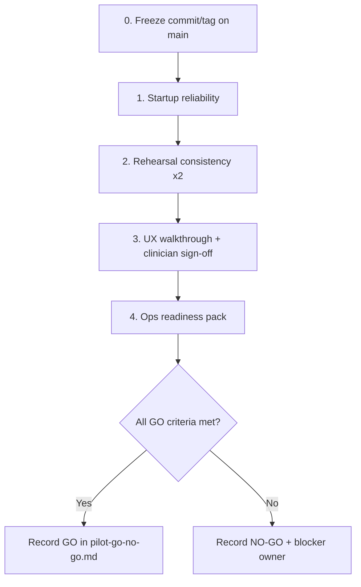

# Pilot Go/No-Go — Detailed Execution Plan

**Owner:** Planning Agent (decision facilitation) + Andres (ops) + clinician lead (UX sign-off)  
**Decision record:** [`pilot-go-no-go.md`](pilot-go-no-go.md)  
**Related runbooks:** [`pilot-rehearsal-checklist.md`](pilot-rehearsal-checklist.md), [`pilot-rehearsal-log.md`](pilot-rehearsal-log.md), [`pilot-clinician-feedback-form.md`](pilot-clinician-feedback-form.md), [`quickstart-clinician.md`](quickstart-clinician.md)

## Purpose

Turn the four GO criteria into an actionable sequence with owners, environments, evidence artifacts, and pass/fail rules — so the team can record a final `GO` or `NO-GO` without ambiguity.

## Where work can run

| Environment | Suitable for |
|-------------|--------------|
| **Clinician Windows + Docker Desktop** | Steps 1–2 (required). Step 3 live walkthrough (required for final UX sign-off). |
| **Cursor cloud / iOS agent session** | Drafting Step 4 docs; reviewing UX copy; running unit/mocked E2E (supporting only). **Cannot** satisfy Steps 1–2 or final Step 3 clinician sign-off. |
| **Offline / async (WhatsApp, call)** | Sharing limitations pack; naming incident owner/window; clinician feedback capture. |

## Current baseline (as of last log, 2026-04-21)

| Criterion | Status | Gap |
|-----------|--------|-----|
| 1 Startup | PASS (historical) | Re-run on **current `main`** (post Sprint 11 merge) before decision |
| 2 Rehearsal | PASS 2/2 consecutive (historical) | Re-run 2× on **current `main`** |
| 3 UX minimum | Simulated Playwright PASS | **Clinician** walkthrough + sign-off still open |
| 4 Ops readiness | Partial | Limitations pack, incident owner/window, tagged rollback not finalized |

**Decision status:** `IN_PROGRESS` — no final GO/NO-GO yet.

---

## Execution sequence (do in order)



### Step 0 — Freeze the candidate build (prerequisite)

| Field | Detail |
|-------|--------|
| **What** | Identify the exact commit (or annotated tag) that will be piloted. |
| **Who** | Andres |
| **Where** | Any git client |
| **Do** | `git checkout main && git pull`; note SHA; optionally `git tag -a pilot-candidate-YYYYMMDD -m "Pilot candidate"` and push tag. |
| **Evidence** | SHA/tag recorded in `pilot-go-no-go.md` decision log and rehearsal log. |
| **Pass** | SHA is on `main`, includes Sprint 11 R1-UI (continuity panels). |

---

### Step 1 — Startup reliability

| Field | Detail |
|-------|--------|
| **What** | Prove clean clinician install boots and answers HTTP checks. |
| **Who** | Andres (or designated facilitator on clinician machine) |
| **Where** | **Windows + Docker Desktop only** |
| **Do** | 1. Copy `.env.clinician.example` → `.env` with at least one AI key.<br>2. `scripts\start-clinician.bat`<br>3. `scripts\health-check-clinician.bat` |
| **Checks** | Containers `Up`; `/health`, `/docs`, frontend `200`; `node scripts/smoke-api.mjs` green. |
| **Evidence** | Append run to [`pilot-rehearsal-log.md`](pilot-rehearsal-log.md) (health section). Update go/no-go “Last health-check run”. |
| **Pass** | Health check exits `0` with no blocking errors. |
| **Fail / no-go** | Docker missing, port conflict, missing keys with no workaround, smoke fail. |
| **Cloud session?** | **No.** |

---

### Step 2 — Rehearsal consistency

| Field | Detail |
|-------|--------|
| **What** | Prove plan generation is stable on synthetic pilot cases, twice. |
| **Who** | Andres / facilitator |
| **Where** | **Windows + Docker** (stack already up from Step 1) |
| **Do** | Run `scripts\run-pilot-rehearsal.bat` **twice** (back-to-back or same day). Cases: `backend/data/pilot/cases.json` (`pilot-001`…`003`). |
| **Per-case pass rules** | HTTP 200; `status = pending_review`; ≥1 week; `insufficient_evidence = false`. |
| **Evidence** | Two dated entries in [`pilot-rehearsal-log.md`](pilot-rehearsal-log.md); go/no-go “Last successful rehearsal” + “consecutive pass 2/2”. |
| **Pass** | Both full suite runs PASS. |
| **Fail / no-go** | Any case fails either run; intermittent failures without root cause. |
| **Cloud session?** | **No** (no Docker). Unit/CI plan smoke is **not** a substitute. |

---

### Step 3 — UX minimum quality

| Field | Detail |
|-------|--------|
| **What** | Confirm a clinician (or clinician + facilitator) can complete the critical path without confusion. |
| **Who** | Clinician lead (primary) + Andres (facilitator/scribe) |
| **Where** | Live app on clinician machine (`http://localhost:5173`) |
| **Do — core path** | Use [`pilot-rehearsal-checklist.md`](pilot-rehearsal-checklist.md) §5–7 and capture notes in go/no-go: |
| | 1. Login (dev or JWT). |
| | 2. **Nuevo paciente** / valid UUID. |
| | 3. Complete mandatory intake; **Guardar intake**; optional **Ver riesgos**. |
| | 4. **Generar plan IA** → Plan Review readable (weeks, citations, status `pending_review`). |
| | 5. Optional approve/reject once. |
| | 6. Continuity panels (post Sprint 11): diary proxy entry, **Cargar progreso**, session log if time allows. |
| | 7. Prediction: **Calcular trayectoria** + **Cargar recomendaciones**; mark Align / Partial / Not aligned. |
| | 8. Force or observe one error path if possible (e.g. bad API key message) — confirm Spanish actionable copy. |
| **Do — feedback** | Complete [`pilot-clinician-feedback-form.md`](pilot-clinician-feedback-form.md) §1–2 and §7 at minimum. |
| **Evidence** | Walkthrough notes in [`pilot-go-no-go.md`](pilot-go-no-go.md); filled feedback form (or summary pasted into log). |
| **Pass** | No critical confusion blocking intake or plan review; practitioner gate preserved; clinician marks ready (or ready with accepted risks). |
| **Fail / no-go** | Critical UX confusion; approve/reject unclear; errors non-actionable; clinician `Not ready` with blocker. |
| **Cloud session?** | **Supporting only** (mocked E2E already covers technical paths). **Final sign-off must be human on live UI.** |

---

### Step 4 — Operational readiness

| Field | Detail |
|-------|--------|
| **What** | Make pilot-day support and rollback explicit before handoff. |
| **Who** | Andres (draft) + clinician lead (ack) |
| **Where** | Docs + messaging; no Docker required for drafting |
| **Do — A. Known limitations pack** | Produce a short list shared with clinician (WhatsApp/PDF). Minimum topics: |
| | - AI suggestions require practitioner approval (NOM-024). |
| | - Diary v1 is **clinician proxy**, not patient self-serve. |
| | - Prediction/recommendations need clinical judgment; not auto-activate. |
| | - Corpus/coverage limits → possible `insufficient_evidence`. |
| | - Dev auth must stay off in any shared/hosted env (`ALLOW_DEV_AUTH=false`). |
| | - Synthetic-only validation to date; real-case alignment still maturing. |
| **Do — B. Incident ownership** | Fill and share: |
| | - **Primary owner:** name + contact |
| | - **Response window:** e.g. same business day / ≤2h during pilot session |
| | - **Escalation:** who if primary unavailable |
| **Do — C. Rollback** | Confirm clinician can run `scripts\stop-clinician.bat`; record prior good SHA/tag to revert to; note “do not pull mid-session”. |
| **Evidence** | Paste completed fields into [`pilot-go-no-go.md`](pilot-go-no-go.md) “Open risks accepted” + ops subsection (use template below). Optional: add `docs/pilot-limitations.md` if the pack grows. |
| **Pass** | Limitations shared (ack from clinician); owner + window named; rollback path stated. |
| **Fail / no-go** | No owner, no rollback plan, or limitations not shared. |
| **Cloud session?** | **Yes for drafting and doc updates.** Sharing/ack is outside the agent. |

#### Step 4 fill-in template (copy into go/no-go decision log)

```text
### Ops readiness (Step 4)

- Limitations pack shared with clinician: Yes/No (date: )
- Clinician ack: Yes/No
- Incident primary owner:
- Contact:
- Response window during pilot session:
- Escalation:
- Rollback: stop-clinician.bat + revert to tag/SHA:
- Notes:
```

---

## Final decision ritual

1. Confirm Steps 1–4 all **PASS** (or Step 3/4 risks explicitly accepted in writing).  
2. Fill decision log in [`pilot-go-no-go.md`](pilot-go-no-go.md): date, owners, `GO` / `NO-GO`, evidence links.  
3. If **GO**: proceed with handoff using [`quickstart-clinician.md`](quickstart-clinician.md); keep feedback form ready for session day.  
4. If **NO-GO**: list single primary blocker, owner, and retest trigger (which step to re-run).

## Definition of done (this plan)

- [ ] Step 0 SHA/tag recorded  
- [ ] Step 1 health PASS on candidate build  
- [ ] Step 2 rehearsal PASS ×2 on candidate build  
- [ ] Step 3 clinician walkthrough notes + feedback input recorded  
- [ ] Step 4 limitations + owner/window + rollback recorded and shared  
- [ ] Final `GO` or `NO-GO` written in `pilot-go-no-go.md`

## Out of scope for go/no-go (track separately)

- `US-DIARY-UI-PATIENT` (patient self-serve diary)  
- R4 mobile / PWA (`US-MOB-001..003`)  
- Production hosting overlay (Hetzner/Neon/etc.) — not required for local Docker pilot  

## Handoff

- **Backlog item:** Pilot GO/NO-GO (ops/process; not a US-\* feature story)  
- **Next owner after plan publish:** Andres — execute Steps 0–2 on Windows; schedule Step 3 with clinician; complete Step 4 pack  
- **Agent role:** Planning maintains this plan; cloud agent may draft Step 4 text only
