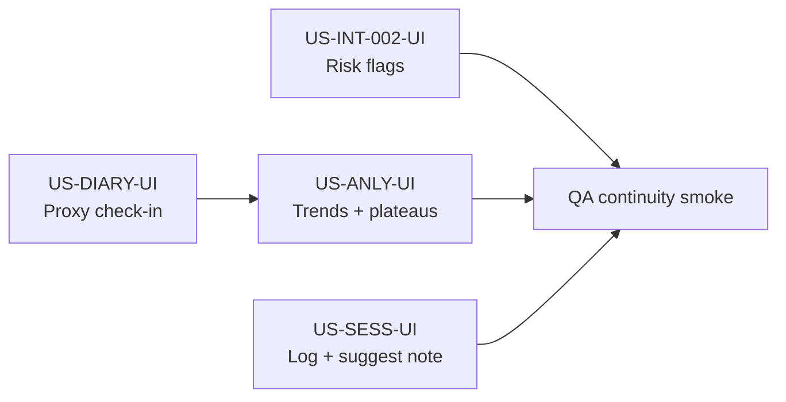

# Sprint 11 — Planning session: MVP UI blockers (continuity loop)

## Sprint parameters

| Field | Value |
|-------|--------|
| Length | Multi-slice release (4 ordered frontend stories; backend APIs already shipped) |
| Primary epic | MVP R1/R2 **UI closeout** — sessions, diary, analytics, intake risk flags |
| Scope | Frontend + Vitest (+ Playwright smoke where flows already have e2e coverage) |
| Owner | Planning Agent (backlog) → Development Agent (TDD) → QA Agent |
| Status | **In development** (UI execution started 2026-07-16) |

## Problem statement

R1/R2 **Must** stories for continuity of care are **backend-complete** but not clinician-usable:

| Story | Backend | UI today |
|-------|---------|----------|
| US-INT-002 | `GET /rag/intake/{id}/risk-flags` | Not shown on Dashboard |
| US-SESS-001 / US-SESS-002 | `POST/GET /rag/sessions*`, `POST …/suggest-note` | No session logger |
| US-DIARY-001 / US-DIARY-002 | `POST/GET /rag/diary*` | No diary entry UI |
| US-ANLY-001 / US-ANLY-002 | `…/outcomes-trend`, `…/plateau-flags` | No trend/plateau panels |

Without these UIs, the six MVP features cannot run **end-to-end** in the clinician app (MVP DoD item 1 in `01-requirements-and-domain-research.md`). Prediction panels (US-PRED-*) already exist but depend on diary data that clinicians cannot enter in-product.

## Planning decisions (locked for this release)

1. **Stay on existing SPA patterns** — extend `Dashboard.jsx` / `api.js` / Spanish clinician copy; no new design system. Preserve current Layout/nav.
2. **Diary v1 = clinician proxy** — clinicians (and admin) enter/list diary check-ins for the current `patient_id` using existing clinician JWT. This unblocks analytics and pilot rehearsal without patient auth/onboarding.
3. **Patient-facing diary route deferred** — follow-on story **US-DIARY-UI-PATIENT** (patient role, `sub == patient_id`). Out of Sprint 11 scope.
4. **No backend contract changes** unless a bug is found; wire to existing schemas (`clinical_session_v0`, `patient_diary_v0`, analytics payloads).
5. **US-MOB-\*** remains R4** — do not expand Sprint 11 into responsive/PWA work; keep desktop clinician pilot path green first.
6. **TDD mandatory** — failing Vitest (builders/mappers/validation) first; then wire UI; then Playwright only for high-value paths already in `clinician-smoke` style.

## Implementation order (dependencies)

| Order | Backlog ID | Priority | Depends on | Why this order |
|-------|------------|----------|------------|----------------|
| 1 | **US-INT-002-UI** | Must | Saved intake (US-INT-004) | Smallest slice; safety visibility on existing intake flow |
| 2 | **US-DIARY-UI** | Must | Patient UUID on Dashboard (US-INT-005) | Creates outcome series required by analytics UI |
| 3 | **US-ANLY-UI** | Must | US-DIARY-UI (data + API client helpers) | Trends + plateau flags for early intervention |
| 4 | **US-SESS-UI** | Must (+ Should assist) | Patient UUID | Independent of diary; can parallelize after #1 if two devs |

**Parallelization note:** After #1 starts, #4 (sessions) can run in parallel with #2/#3. Do **not** start #3 before #2 is green (empty-state UX only is allowed as a stub, not as “done”).

---

## Ready-for-dev stories

### US-INT-002-UI — Surface intake risk flags on Dashboard

**Parent:** US-INT-002 (backend done)  
**Actor:** Clinician  
**Value:** See contraindications/risks before generating a plan without leaving the intake flow.

#### Scope

- After successful **Cargar intake guardado** (or when intake is known present), call `GET /rag/intake/{patient_id}/risk-flags`.
- Render a compact list: severity (if present), explanation text; empty state = “Sin banderas de riesgo”.
- On `404`/`503`, show actionable Spanish error; do not block plan generation.
- Optional stretch: “acknowledge” checkboxes are **out of scope** until backend stores acknowledgements (AC in parent story); UI is read-only display this slice.

#### Acceptance criteria

- [x] Given a saved intake with risk hits, when clinician loads intake or clicks **Ver riesgos**, then flags appear with explanation text.
- [x] Given no flags, when analysis returns empty, then clinician sees a clear empty state (not an error).
- [x] Given missing intake (`404`) or analysis failure (`503`), when request fails, then a Spanish actionable message is shown and generate remains available.
- [x] Given invalid patient UUID, when risk load is attempted, then UI blocks the call (reuse `isValidUuidV4`).

#### Test intent

- Unit: mapper/normalizer for risk-flag payload → display model (if non-trivial).
- Component/integration: API client method + Dashboard wiring with mocked axios.
- E2E: optional one step in clinician smoke after intake load (non-blocking if flaky).

#### API contract (existing)

- `GET /rag/intake/{patient_id}/risk-flags` — clinician/admin JWT.

#### Estimate

S

---

### US-DIARY-UI — Clinician proxy diary check-in + history

**Parents:** US-DIARY-001, US-DIARY-002 (backend done)  
**Actor:** Clinician (proxy for patient in pilot)  
**Value:** Enter daily outcomes so continuity analytics and prediction panels have real series data in-product.

#### Scope

- Dashboard section **Diario del paciente** bound to current `patient_id`.
- Form fields: `checkin_date`, `pain_nrs_0_10`, `sleep_quality_0_10`, `mood_0_10`, `function_0_10`, optional `notes_es` (max 1500).
- Submit builds `patient_diary_v0` and `POST /rag/diary` (upsert same day).
- List recent entries via `GET /rag/diary/patient/{patient_id}` (limit ~14 default).
- Field-level validation aligned with backend (0–10 ints, date required).

#### Acceptance criteria

- [ ] Given valid scores and date, when clinician saves, then entry persists and appears in the history list (upsert replaces same calendar day).
- [ ] Given out-of-range scores or empty required fields, when submit is attempted, then UI blocks with field-level Spanish errors (no API call).
- [ ] Given optional `notes_es`, when provided, then it is trimmed and shown in history; blank → omitted/`null`.
- [ ] Given API `401`/`403`/`422`, when save fails, then `formatApiError` surfaces an actionable message.
- [ ] Given no `patient_id` / invalid UUID, when save or list is attempted, then UI blocks like other Dashboard actions.

#### Explicitly out of scope

- Patient login / patient-only route (`US-DIARY-UI-PATIENT`).
- Charts (owned by US-ANLY-UI).
- Push/WhatsApp reminders.

#### Test intent

- Unit: `diaryBuilder.js` (or equivalent) — form ↔ `patient_diary_v0`; validation.
- Integration: `ragApi.createDiary` / `listDiary` in `api.js`.
- E2E: deferred or single smoke “save diary → list shows row”.

#### API contract (existing)

- `POST /rag/diary`
- `GET /rag/diary/patient/{patient_id}`

#### Estimate

M

---

### US-ANLY-UI — Outcome trends + plateau flags on Dashboard

**Parents:** US-ANLY-001, US-ANLY-002 (backend done)  
**Actor:** Clinician  
**Value:** Evaluate therapy effectiveness and intervene earlier when pain/function worsen or plateau.

#### Scope

- Section **Progreso** (or equivalent) for current `patient_id`.
- Load `GET …/outcomes-trend` (default API window) and render a readable series (table first is acceptable; simple SVG/CSS sparkline optional — **no new chart library** unless already in package.json).
- Load `GET …/plateau-flags`; show `analysis_status`, flag `message`/`detail`/`severity`.
- Empty / `insufficient_data` states in Spanish; date range controls optional stretch (defaults OK for v1).

#### Acceptance criteria

- [ ] Given diary rows in range, when clinician opens progreso, then pain/sleep/mood/function points are shown in chronological order.
- [ ] Given plateau API returns flags, when panel loads, then each flag shows Spanish rationale (`message` / `detail`).
- [ ] Given `analysis_status = insufficient_data`, when panel loads, then clinician sees “datos insuficientes” (no false alarms).
- [ ] Given API error, when load fails, then actionable error; other Dashboard sections remain usable.

#### Test intent

- Unit: series → display rows; flag list rendering helpers.
- Integration: API client methods + mocked responses for ok / insufficient_data / error.
- E2E: after diary seed in smoke (if added), flags or empty-state visible.

#### API contract (existing)

- `GET /rag/analytics/patient/{patient_id}/outcomes-trend`
- `GET /rag/analytics/patient/{patient_id}/plateau-flags`

#### Estimate

M

---

### US-SESS-UI — Structured session log + AI note suggest

**Parents:** US-SESS-001 (Must), US-SESS-002 (Should)  
**Actor:** Clinician  
**Value:** Capture interventions/observations longitudinally; reduce documentation time with optional AI assist.

#### Scope

- Dashboard (or dedicated `/sessions` route if Dashboard density becomes harmful — **prefer Dashboard section first** for pilot consistency).
- Form: `session_at`, one+ interventions (`therapy_type`, `description`, optional `duration_minutes`), `observations`, optional `patient_reported_response`.
- Save via `POST /rag/sessions`; history via `GET /rag/sessions/patient/{patient_id}`.
- **Should:** button **Sugerir nota** → `POST /rag/sessions/suggest-note` fills observations draft (clinician must edit/accept before save).

#### Acceptance criteria

- [ ] Given at least one intervention and non-empty observations, when clinician saves, then session appears in reverse-chronological history.
- [ ] Given empty interventions or empty observations, when submit is attempted, then UI validation blocks (`clinical_session_v0` rules).
- [ ] Given interventions entered, when **Sugerir nota** succeeds, then suggested text is applied to a draft field the clinician can edit before save.
- [ ] Given suggest-note `422`/`401`/`5xx`, when assist fails, then clear error; form remains editable.
- [ ] Unauthenticated behavior is already API-enforced; UI relies on existing `RequireClinician`.

#### Test intent

- Unit: `sessionBuilder.js` — form ↔ `clinical_session_v0` / note-assist payload.
- Integration: API client + mocked suggest/save/list.
- E2E: optional smoke save session.

#### API contract (existing)

- `POST /rag/sessions`
- `GET /rag/sessions/patient/{patient_id}`
- `POST /rag/sessions/suggest-note`

#### Estimate

M (Must log) + S (Should assist) — ship together if assist is already one endpoint.

---

## Deferred (tracked, not Sprint 11)

| ID | Note |
|----|------|
| US-DIARY-UI-PATIENT | Patient role check-in page + auth linking (`sub` = patient UUID) |
| US-INT-003-UI | Admin audit trail viewer |
| US-MOB-001..003 | R4 mobile/PWA (see `mobile-strategy-v0.md`) |
| Risk-flag acknowledgements | Needs persistence design before UI checkboxes |

## Risks / issues

| Risk | Mitigation |
|------|------------|
| Dashboard becomes overcrowded | Prefer collapsible `<section>` / `
` per module; split route only if usability fails pilot walkthrough |
| Clinician-proxy diary confused with patient self-report | Label UI **“Registro de diario (practicante)”** and document in user guide |
| Analytics empty in pilot | Seed path: diary UI first; update `pilot-rehearsal-checklist.md` after UI lands |
| Suggest-note LLM cost/latency | Keep assist optional; never block save on assist failure |
| Scope creep into mobile | Explicitly out of Sprint 11 |

## Definition of done (Sprint 11 release)

- [x] All four UI stories meet acceptance criteria above (implementation + unit tests).
- [x] Vitest coverage for new builders/validators; lint clean.
- [x] `docs/07-user-guide.md` updated with Diario / Sesiones / Progreso / Riesgos.
- [x] Backlog statuses in `04-feature-specs-and-user-stories.md` updated to **Done (UI + API)** for completed parents.
- [ ] Handoff to QA with pass/fail per story (template below).

## Handoff template (per story)

- Backlog item ID:
- Scope:
- Acceptance criteria: (pass/fail per bullet)
- Test evidence: (commands + results)
- Risks/issues:
- Next owner: QA Agent → Planning Agent (status update)

## Next owner

**QA Agent** — validate Sprint 11 acceptance criteria; then Planning Agent updates final backlog status.

## Dev handoff (2026-07-16)

- Backlog item ID: US-INT-002-UI, US-DIARY-UI, US-ANLY-UI, US-SESS-UI
- Scope: Dashboard panels + builders (`riskFlags`, `diaryBuilder`, `analyticsDisplay`, `sessionBuilder`) + `ragApi` client methods. No backend contract changes.
- Acceptance criteria: implementation complete; unit tests green (36 Vitest). E2E Playwright not expanded this slice.
- Test evidence: `cd frontend && npm run lint && npm test && npm run build`
- Risks/issues: Dashboard density; diary is clinician-proxy only.
- Next owner: QA Agent
