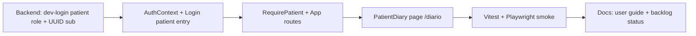

# Sprint 12 — US-DIARY-UI-PATIENT (patient self-serve diary)

## Sprint parameters

| Field | Value |
|-------|--------|
| Length | Single product slice (auth wiring + patient diary SPA) |
| Primary story | **US-DIARY-UI-PATIENT** |
| Parents | US-DIARY-001, US-DIARY-002, US-DIARY-UI (Sprint 11 clinician proxy) |
| Priority | Should (R2+) — next product slice after R1-UI |
| Scope | Frontend patient route + minimal patient JWT issuance for local/pilot; reuse `patient_diary_v0` APIs |
| Owner | Planning → Development (TDD) → QA |
| Status | **Complete / QA PASS** (2026-07-16) |

## Problem statement

Sprint 11 shipped **clinician-proxy** diary entry on the Dashboard. Patients still cannot submit their own daily check-ins. Backend already enforces:

- `POST /rag/diary` and `GET /rag/diary/patient/{id}` allow role `patient`
- `ensure_diary_subject_access`: patient JWT `sub` **must equal** `patient_id` (UUID) or `403`

Gaps today:

- Dev login only issues `clinician` / `admin` (`DevLoginRequest`)
- SPA wraps all app routes in `RequireClinician` (auth-only gate; no patient home)
- Login copy is clinician-only; no patient diary page

## Planning decisions (locked)

1. **Reuse diary payload builders** — `frontend/src/utils/diaryBuilder.js` + `ragApi.saveDiary` / `listDiary` from Sprint 11. Do not fork schemas.
2. **Patient home = `/diario`** — dedicated page (not Dashboard). Spanish UI; mobile-friendly layout preferred but **not** full PWA (`US-MOB-*` stays R4).
3. **Auth for this slice (minimal):**
   - Extend `POST /auth/dev-login` to allow `role: "patient"` when `ALLOW_DEV_AUTH=true`, with `sub` required to be a **UUID v4** (same id clinicians already copy).
   - Login gains **«Entrar (desarrollo — paciente)»**: prompts for / uses pasted patient UUID as `sub`, then navigates to `/diario`.
   - Manual JWT paste remains supported if claims are `{ role: "patient", sub: "<uuid-v4>" }`.
4. **Route guards:**
   - `RequirePatient` — authenticated + `role === "patient"` + valid UUID `sub`; else redirect `/login`.
   - Clinician routes stay under existing guard; **patients hitting `/dashboard` redirect to `/diario`**.
   - Clinicians hitting `/diario` redirect to `/dashboard` (proxy diary remains clinician tool).
5. **No production IdP / magic link / WhatsApp / email invite** in Sprint 12. Document as follow-on (`US-DIARY-AUTH-PROD` placeholder).
6. **No analytics/prediction UI for patients** — diary write + own history only. Trends stay clinician Dashboard.
7. **NOM-024:** diary self-report does not activate treatment plans; no change to plan approval gate.
8. **TDD:** expand Vitest for auth helpers / routing predicates; Playwright patient diary smoke (mocked APIs).

## Dependencies

| Depends on | Why |
|------------|-----|
| US-DIARY-001 / 002 | Backend diary API + `notes_es` |
| US-DIARY-UI | Shared `diaryBuilder` + API client |
| US-INT-005 | Clinician already generates/shares UUID v4 patient ids |

## Implementation order

| Order | Work item | Notes |
|-------|-----------|-------|
| 1 | Backend `DevLoginRequest` + tests | Allow `patient`; validate `sub` is UUID v4 when role=patient |
| 2 | AuthContext `loginDevPatient(sub)` | Thin wrapper over `authApi.devLogin` |
| 3 | Login UI patient path | UUID field + button; redirect `/diario` |
| 4 | Guards + `App.jsx` routes | Split clinician vs patient trees |
| 5 | `PatientDiary.jsx` | Form + history; `patient_id` = auth `sub` only |
| 6 | QA tests + docs | E2E smoke; update `07-user-guide.md` |

---

## Ready-for-dev story

### US-DIARY-UI-PATIENT — Patient self-serve daily diary

**Actor:** Patient  
**Value:** Submit pain/sleep/mood/function (and optional Spanish notes) between sessions without clinician typing for them.

#### Scope

- Page `/diario` (Spanish): date, four 0–10 scores, optional `notes_es`, save, list recent own entries.
- Auth: patient JWT; `patient_id` always from token `sub` (never a free-typed id on this page).
- Dev path: login as patient with UUID; production invite flow deferred.

#### Explicitly out of scope

- Patient registration / password reset / IdP
- Push/WhatsApp reminders
- Patient view of plans, sessions, analytics, chunks
- Changing clinician-proxy diary on Dashboard

#### Acceptance criteria

- [x] Given a patient JWT with UUID `sub`, when the patient opens `/diario`, then they see a check-in form bound to that id (id shown read-only / copyable).
- [x] Given valid scores and date, when they save, then `POST /rag/diary` succeeds and the entry appears in their history list (same-day upsert).
- [x] Given invalid scores or missing date, when they submit, then client validation blocks the API call (reuse `validateDiaryForm`).
- [x] Given optional notes, when blank/whitespace, then payload sends `notes_es: null`; when present, trimmed and shown in history.
- [x] Given a patient token, when they request another patient’s diary id, then API returns `403` (existing backend); UI never offers another id.
- [x] Given role `clinician`/`admin`, when visiting `/diario`, then redirect to `/dashboard`.
- [x] Given role `patient`, when visiting `/dashboard` (or plan/chunks), then redirect to `/diario` (or login if unauthenticated).
- [x] Given `ALLOW_DEV_AUTH=true`, when login uses patient + valid UUID v4 `sub`, then a patient token is issued and `/diario` loads.
- [x] Given `ALLOW_DEV_AUTH=false`, when patient dev-login is attempted, then failure is actionable (404 route absent) — same as clinician dev login.

#### Test intent

- Unit: UUID gate for patient `sub`; reuse diaryBuilder tests; optional small `authRoles` helper (patient vs clinician route eligibility).
- Backend: `test_auth_dev_login.py` — patient role accepted; non-UUID sub rejected with `422`; clinician path unchanged.
- E2E: Playwright — patient login (mocked or real route) → fill diary → save → history row; clinician cannot stay on `/diario`.

#### API contract (existing + small auth extension)

| Method | Path | Notes |
|--------|------|-------|
| POST | `/rag/diary` | Unchanged body `{ patient_id, checkin }` |
| GET | `/rag/diary/patient/{patient_id}` | Patient only for self |
| POST | `/auth/dev-login` | **Extend** `role` Literal to include `patient`; validate UUID `sub` when patient |

#### Estimate

M (frontend + small backend auth)

---

## Follow-on (tracked, not Sprint 12)

| ID | Note |
|----|------|
| US-DIARY-AUTH-PROD | Real patient auth (invite link / OTP / clinic IdP); revoke/rotate tokens |
| US-DIARY-REMINDERS | WhatsApp/email daily check-in prompts |
| US-MOB-001..003 | PWA / installable shell (may later wrap `/diario`) |

## Risks / issues

| Risk | Mitigation |
|------|------------|
| Patients use clinician Dashboard if guard is auth-only | Explicit `RequirePatient` + role-based redirects |
| Dev-login patient widens attack surface if left on in prod | Keep `ALLOW_DEV_AUTH=false` in prod; document checklist |
| UUID sharing is weak “identity” | Accept for pilot/dev only; production auth follow-on |
| Confusion with clinician-proxy diary | Keep Dashboard label; patient page titled **«Mi diario»** |
| Layout/nav exposes clinician links | Patient layout minimal (logo + logout only) — no Chunks/Plan |

## Definition of done

- [x] Acceptance criteria above pass (unit + backend auth tests + Playwright)
- [x] Lint/build green; no regression to clinician smoke
- [x] Backlog: US-DIARY-UI-PATIENT → Done; release note in CHANGELOG
- [x] `docs/07-user-guide.md` patient section + clinician “share UUID” note
- [x] QA report with pass/fail

## Handoff template

- Backlog item ID: US-DIARY-UI-PATIENT
- Scope: Patient `/diario` + patient JWT via extended dev-login; role redirects
- Acceptance criteria: **PASS** (see `docs/qa-sprint-12-report.md`)
- Test evidence: backend auth 5/5; Vitest 42/42; Playwright sprint12 3/3; lint/build green
- Risks/issues: UUID-as-identity is pilot/dev only (`US-DIARY-AUTH-PROD` follow-on)
- Next owner: Planning Agent (closeout / prioritize next slice)

## Next owner

**Planning Agent** — Sprint 12 closed (merged PR #9). Next slice planned: **US-DIARY-AUTH-PROD** — [`sprint-13.md`](sprint-13.md).
