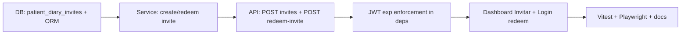

# Sprint 13 — US-DIARY-AUTH-PROD (patient invite-link auth)

## Sprint parameters

| Field | Value |
|-------|--------|
| Length | Single product slice (invite issuance + redeem → patient JWT) |
| Primary story | **US-DIARY-AUTH-PROD** |
| Parents | US-DIARY-UI-PATIENT (Sprint 12), US-DIARY-001/002, US-INT-005 |
| Priority | Should (R2+) — next product slice after patient `/diario` |
| Scope | Production-capable **patient** authentication via clinician-issued invite links; keep diary SPA unchanged |
| Owner | Planning → Development (TDD) → QA |
| Status | **Ready for development** (planning complete 2026-07-16) |

## Problem statement

Sprint 12 shipped `/diario` and patient JWT subject binding, but the only patient login path is:

- `POST /auth/dev-login` with `role=patient` + UUID `sub` (`ALLOW_DEV_AUTH=true`), or
- Pasting a hand-minted JWT

That is **not** production identity (UUID knowledge ≈ password). With `ALLOW_DEV_AUTH=false`, patients cannot obtain tokens at all.

Diary **authorization** is already correct (`ensure_diary_subject_access`). This sprint adds a real **authentication** issuance path that works when dev auth is off.

## Why this slice (not OTP / IdP / mobile / GO-NO-GO)

| Candidate | Decision |
|-----------|----------|
| **US-DIARY-AUTH-PROD (invite-link)** | **Selected** — smallest path that unblocks real patient diary without IdP |
| OTP (email/SMS) | Deferred — provider cost, PII binding, LFPDPPP consent surface |
| Clinic IdP (OIDC) | Deferred — needs clinic IdP readiness |
| `docker-compose.prod.yml` alone | Complementary but **insufficient alone** (turns off login for everyone); track as follow-on ops |
| Pilot GO/NO-GO | Ops/clinical sign-off; optional; does not close auth gap |
| US-MOB-001..003 | R4; patient auth still UUID/dev if done first |

## Planning decisions (locked)

1. **Mechanism = opaque invite token (magic link style), not OTP/IdP.**
   - Clinician (or admin) creates an invite for a patient UUID.
   - System returns a **single-use** redeem URL / token with **TTL** (default **7 days**, configurable).
   - Patient redeems once → receives patient JWT (`role=patient`, `sub=<uuid>`).
2. **No outbound email/WhatsApp provider in Sprint 13.** Clinician copies the invite link and shares out-of-band (clinic already does this for UUID today). Delivery automation = `US-DIARY-REMINDERS` / later channel work.
3. **Patient JWT includes `exp`** (default **30 days** after redeem). `get_current_user` **rejects expired tokens**. Tokens **without** `exp` remain accepted for backward compatibility (clinician/dev) — follow-on to require `exp` everywhere.
4. **Invite storage** — new table (e.g. `patient_diary_invites`): `id`, `patient_id`, `token_hash`, `expires_at`, `redeemed_at` (nullable), `created_by` (clinician `sub`), `created_at`. Store **hash only** (never plaintext token at rest).
5. **Public redeem endpoint** (no auth): `POST /auth/redeem-invite` with `{ "token": "..." }` → `{ access_token, token_type, role, sub, expires_at }`. Rate-limit friendly design (constant-ish errors; no patient existence leak beyond “invalid/expired”).
6. **Clinician create endpoint** (auth `clinician`/`admin`): `POST /rag/diary/invites` with `{ "patient_id": "<uuid-v4>" }` → `{ invite_id, expires_at, redeem_path, token }` (plaintext token returned **once**).
7. **SPA:**
   - Dashboard: **«Invitar al diario»** next to patient UUID tools — creates invite, shows copyable link (`/login?invite=<token>` or `/diario/invitar?t=` → redeem then `/diario`).
   - Login: if `?invite=` present, auto-redeem (or confirm button); also allow paste of invite token. On success → `/diario`.
   - Keep existing **dev login** paths when `ALLOW_DEV_AUTH=true` (local/pilot).
8. **Out of scope this sprint:**
   - Clinic IdP / OIDC / SAML
   - OTP email/SMS providers
   - Clinician production login / seed user store (`US-AUTH-CLINICIAN-PROD`)
   - Full `docker-compose.prod.yml` + Caddy (ops follow-on; document checklist only)
   - Token refresh / refresh cookies / device sessions
   - Revocation list beyond single-use invite + JWT expiry
   - Changing diary API contracts or NOM-024 plan approval
9. **NOM-024:** patient auth must not grant plan approve/reject; patients stay on `/diario` only.
10. **TDD:** backend invite create/redeem/expiry/reuse tests; Vitest for invite URL helpers; Playwright redeem → diary smoke (mocked).

## Dependencies

| Depends on | Why |
|------------|-----|
| US-DIARY-UI-PATIENT | `/diario`, `RequirePatient`, subject-bound diary APIs |
| US-INT-005 | Clinician already has patient UUID to invite |
| JWT + `require_roles` | Issue standard patient claims |

## Implementation order

| Order | Work item | Notes |
|-------|-----------|-------|
| 1 | Migration / `infra/init.sql` + model | Hash column; unique token_hash |
| 2 | Invite service (create, redeem, expire, single-use) | Pure async service; no LLM |
| 3 | API routes + tests | Clinician create; public redeem |
| 4 | `get_current_user` rejects `exp` in the past | Leave missing `exp` valid for now |
| 5 | Frontend Dashboard invite + Login redeem | Copy link UX |
| 6 | QA + user guide + security notes | Update TODO-SEC / runbook pointers |

---

## Ready-for-dev story

### US-DIARY-AUTH-PROD — Patient diary invite-link authentication

**Actor:** Clinician (issues) / Patient (redeems)  
**Value:** Patients can authenticate to `/diario` without `ALLOW_DEV_AUTH` and without treating the raw UUID as a password.

#### Scope

- Invite create (clinician/admin) + redeem (public) → patient JWT with `exp`
- SPA: Dashboard invite + Login redeem (`?invite=` / paste)
- Persist invite hashes; single-use; TTL

#### Explicitly out of scope

- Email/SMS/WhatsApp send
- OTP / IdP
- Clinician credential store
- Prod compose overlay implementation
- Refresh tokens / global revoke list

#### Acceptance criteria

- [ ] Given a clinician JWT and valid patient UUID, when they create an invite, then API returns a one-time token + expiry and stores only a hash.
- [ ] Given a valid unexpired unused invite token, when the patient redeems it, then they receive a patient JWT with `sub` = that UUID, `role=patient`, and future `exp`.
- [ ] Given the same invite token again, when redeemed, then API returns **410/400** (already used) and no new JWT.
- [ ] Given an expired invite, when redeemed, then API returns **410/400** and no JWT.
- [ ] Given `ALLOW_DEV_AUTH=false`, when redeem succeeds, then `/diario` works (no dependency on `/auth/dev-login`).
- [ ] Given an expired patient JWT (`exp` past), when calling diary APIs, then **401**.
- [ ] Given Login with `?invite=<token>`, when redeem succeeds, then navigate to `/diario` with patient session.
- [ ] Given Dashboard **Invitar al diario**, when invite is created, then clinician can copy a redeem URL for the current patient UUID.
- [ ] Patients still cannot access clinician routes; clinicians still cannot stay on `/diario`.
- [ ] Dev-login clinician/patient paths remain available only when `ALLOW_DEV_AUTH=true`.

#### Test intent

- Unit/service: hash invite, expire, single-use, wrong token.
- API: create requires clinician; redeem public; diary still 403 cross-patient.
- Frontend: invite URL builder; Login redeem flow (Vitest + Playwright mocked).
- Regression: Sprint 12 diary e2e + clinician smoke still pass.

#### API contract (new)

| Method | Path | Auth | Notes |
|--------|------|------|-------|
| POST | `/rag/diary/invites` | clinician/admin | Body `{ patient_id }`; returns token once |
| POST | `/auth/redeem-invite` | none | Body `{ token }`; returns bearer JWT |

Existing diary routes unchanged.

#### Estimate

M–L (backend invite + JWT exp + small SPA)

#### Config (suggested)

| Setting | Default | Purpose |
|---------|---------|---------|
| `DIARY_INVITE_TTL_HOURS` | `168` (7d) | Invite lifetime |
| `PATIENT_JWT_TTL_HOURS` | `720` (30d) | Patient access token lifetime |
| `PUBLIC_APP_BASE_URL` | `http://localhost:5173` | Build absolute redeem links in API responses (optional) |

---

## Follow-on (tracked, not Sprint 13)

| ID | Note |
|----|------|
| US-AUTH-CLINICIAN-PROD | Clinician seed / password or IdP when `ALLOW_DEV_AUTH=false` |
| US-OPS-PROD-COMPOSE | `docker-compose.prod.yml` + Caddyfile + CORS/TLS; force `ALLOW_DEV_AUTH=false` |
| US-DIARY-REMINDERS | Channel delivery of invites / daily prompts |
| US-AUTH-JWT-HARDEN | Require `exp` on all roles; refresh; revoke |
| US-MOB-001..003 | R4 mobile |
| Clinic IdP / OTP | Larger auth evolutions |

## Risks / issues

| Risk | Mitigation |
|------|------------|
| Invite link leaked = account access until redeem/expiry | Short TTL; single-use; hash at rest; HTTPS in prod checklist |
| Clinician still needs a token when prod auth off | Keep manual JWT / seed as `US-AUTH-CLINICIAN-PROD`; document for pilot |
| Missing `exp` on old tokens | Explicit backward-compat; harden later |
| Absolute URL wrong behind proxies | Prefer relative redeem path in UI; optional `PUBLIC_APP_BASE_URL` |
| Confusion with UUID login | Login copy: invite = production path; UUID login = desarrollo only |

## Definition of done

- [ ] Acceptance criteria pass (service + API + Playwright)
- [ ] Lint/build green; Sprint 12 + clinician regression green
- [ ] Backlog: US-DIARY-AUTH-PROD → Done; CHANGELOG note
- [ ] User guide: clinician invite + patient redeem; security audit pointer
- [ ] QA report with pass/fail

## Handoff template

- Backlog item ID: US-DIARY-AUTH-PROD
- Scope:
- Acceptance criteria: (pass/fail)
- Test evidence:
- Risks/issues:
- Next owner: QA → Planning

## Next owner

**Development Agent** — start with invite model + service tests (TDD), then redeem API, then SPA.
