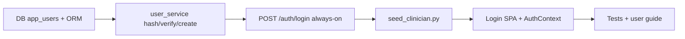

# Sprint 14 — US-AUTH-CLINICIAN-PROD (clinician password login)

## Sprint parameters

| Field | Value |
|-------|--------|
| Length | Single product slice (credential store + login API + SPA form) |
| Primary story | **US-AUTH-CLINICIAN-PROD** |
| Parents | JWT RBAC (`require_roles`), Sprint 13 patient invites (complement) |
| Priority | Should (R2+) — unblock clinician SPA when `ALLOW_DEV_AUTH=false` |
| Scope | Local clinician/admin user store + password login issuing JWT with `exp` |
| Owner | Planning → Development (TDD) → QA |
| Status | **Complete / QA PASS** (2026-07-16) |

## Problem statement

Sprint 13 gave patients a production-capable login (invite redeem) with `ALLOW_DEV_AUTH=false`. Clinicians still only have:

- `POST /auth/dev-login` (absent in prod → 404), or
- Pasting a JWT minted offline with `SECRET_KEY`

There is **no users table**, no seed script (docs name `seed_clinician.py` but it is missing), and `passlib[bcrypt]` is unused. Prod clinician access is blocked without weakening `ALLOW_DEV_AUTH`.

## Why this slice

| Candidate | Decision |
|-----------|----------|
| **US-AUTH-CLINICIAN-PROD (password + seed)** | **Selected** — matches deployment quickstart; smallest unblock |
| Bundle with `US-OPS-PROD-COMPOSE` | Deferred — keep product auth separate from compose overlay |
| Clinician magic-link (mirror patients) | Deferred — chicken-egg for first admin; weaker for daily sessions |
| R4 mobile first | Deferred — still needs a real clinician token path |

## Planning decisions (locked)

1. **Local credential store** — table `app_users` (or `clinician_users`): `id`, `username` (unique), `password_hash`, `role` (`clinician`|`admin`), `is_active`, `created_at`. No OIDC/IdP this sprint.
2. **Password hashing** — use existing `passlib[bcrypt]`; never store plaintext.
3. **Login API (always mounted):** `POST /auth/login` with `{ "username", "password" }` → `{ access_token, token_type, role, sub, expires_at }`.  
   - `sub` = user id UUID (string).  
   - JWT includes `exp` (default **8 hours**, `CLINICIAN_JWT_TTL_HOURS`).  
   - Constant-ish error for bad username/password (**401**).
4. **Seed script** — `backend/scripts/seed_clinician.py`: creates one user from env (`SEED_CLINICIAN_USERNAME`, `SEED_CLINICIAN_PASSWORD`, `SEED_CLINICIAN_ROLE=clinician|admin`). Idempotent (skip/update if username exists). Document one-time `docker compose exec` usage.
5. **SPA Login** — primary clinician form: username + password → `authApi.login` → store token → `/dashboard`. Keep: invite redeem (patients), optional JWT paste (advanced), and **dev login** only when backend allows it (unchanged).
6. **RBAC unchanged** — issued roles remain `clinician`/`admin`; patients cannot use this endpoint to escalate.
7. **Out of scope:** compose prod overlay, refresh tokens, password reset email, MFA, IdP, requiring `exp` on *all* historical tokens (`US-AUTH-JWT-HARDEN`), clinician magic links.
8. **NOM-024:** login does not auto-approve plans; approval routes stay clinician/admin-gated.
9. **TDD:** hash/verify unit tests; login API (ok / wrong password / inactive); seed script smoke; Playwright clinician password login (mocked).

## Dependencies

| Depends on | Why |
|------------|-----|
| JWT + `require_roles` | Issue standard clinician claims |
| `passlib[bcrypt]` | Already in requirements |
| Existing Login / AuthContext | Wire password path |

## Implementation order

| Order | Work item | Notes |
|-------|-----------|-------|
| 1 | `infra/init.sql` + model | Unique username |
| 2 | `user_service` | bcrypt hash/verify; create/get active user |
| 3 | `POST /auth/login` on `auth_router` | Reuse `encode_access_token(..., exp=)` |
| 4 | `seed_clinician.py` + env docs | Idempotent |
| 5 | Frontend Login + `loginWithPassword` | Spanish labels |
| 6 | QA + security checklist note | Update TODO-SEC / setup |

---

## Ready-for-dev story

### US-AUTH-CLINICIAN-PROD — Clinician/admin password authentication

**Actor:** Clinician / Admin  
**Value:** Sign in to the SPA when `ALLOW_DEV_AUTH=false` without minting JWTs by hand.

#### Scope

- User table + bcrypt passwords  
- `POST /auth/login` → JWT with `exp`  
- Seed script for bootstrap user  
- Login form (username/password)

#### Explicitly out of scope

- IdP / OIDC / SAML  
- Password reset / email  
- Prod compose overlay  
- Patient password accounts (patients stay on invite)

#### Acceptance criteria

- [ ] Given a seeded active clinician, when they submit correct username/password, then API returns JWT with `role` clinician|admin, `sub` = user id, and future `exp`.
- [ ] Given wrong password or unknown user, when login is attempted, then API returns **401** with a generic message (no user enumeration detail).
- [ ] Given `is_active=false`, when login is attempted, then **401**.
- [ ] Given `ALLOW_DEV_AUTH=false`, when password login succeeds, then Dashboard loads (no dependency on `/auth/dev-login`).
- [ ] Given seed script run twice with same username, when executed, then it does not create duplicates (idempotent).
- [ ] Passwords are stored only as hashes (never plaintext in DB or logs).
- [ ] Login SPA: username/password form signs clinician into `/dashboard`.
- [ ] Patient invite redeem and role redirects remain unchanged.
- [ ] Dev-login remains available only when `ALLOW_DEV_AUTH=true`.

#### Test intent

- Unit: hash/verify; inactive user rejected.  
- API: 200 happy path; 401 wrong/missing; works with create_app(`ALLOW_DEV_AUTH=false`).  
- E2E: mocked login → dashboard.  
- Regression: sprint12/13 patient flows.

#### API contract (new)

| Method | Path | Auth | Notes |
|--------|------|------|-------|
| POST | `/auth/login` | none | `{ username, password }` → bearer JWT |

#### Config (suggested)

| Setting | Default | Purpose |
|---------|---------|---------|
| `CLINICIAN_JWT_TTL_HOURS` | `8` | Access token lifetime |
| `SEED_CLINICIAN_USERNAME` | (required for seed) | Bootstrap username |
| `SEED_CLINICIAN_PASSWORD` | (required for seed) | Bootstrap password (env only) |
| `SEED_CLINICIAN_ROLE` | `clinician` | `clinician` or `admin` |

#### Estimate

M

---

## Follow-on (tracked, not Sprint 14)

| ID | Note |
|----|------|
| US-OPS-PROD-COMPOSE | `docker-compose.prod.yml` + Caddyfile + CORS/TLS |
| US-AUTH-JWT-HARDEN | Require `exp` all roles; refresh; revoke |
| US-AUTH-PASSWORD-RESET | Self-service / admin reset |
| Clinic IdP | OIDC when clinic ready |
| US-MOB-001..003 | R4 mobile |

## Risks / issues

| Risk | Mitigation |
|------|------------|
| Weak seed password left in prod | Document strong password; never commit secrets; rotate |
| Brute-force on `/auth/login` | Generic 401; follow-on rate limit / lockout |
| Username enumeration | Same error for unknown vs wrong password |
| Existing DBs need DDL | Document `app_users` fragment from `init.sql` |
| Confusion with patient invite UI | Clear Login sections: clínico vs paciente |

## Definition of done

- [ ] Acceptance criteria pass (unit + API + Playwright)
- [ ] Lint/build green; Sprint 12/13 regression green
- [ ] Backlog Done + CHANGELOG
- [ ] User guide + setup/seed docs
- [ ] QA report pass/fail

## Handoff template

- Backlog item ID: US-AUTH-CLINICIAN-PROD
- Scope:
- Acceptance criteria: (pass/fail)
- Test evidence:
- Risks/issues:
- Next owner: QA → Planning

## Next owner

**Development Agent** — start with `app_users` model + hash/verify tests (TDD), then login API, seed script, SPA.
