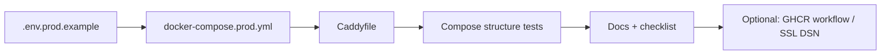

# Sprint 15 — US-OPS-PROD-COMPOSE (production Compose overlay)

## Sprint parameters

| Field | Value |
|-------|--------|
| Length | Ops slice (compose + Caddy + env contract + CI validation) |
| Primary story | **US-OPS-PROD-COMPOSE** |
| Parents | US-AUTH-CLINICIAN-PROD, US-DIARY-AUTH-PROD (prod login paths when dev auth off) |
| Priority | Should (R2+) — enable deployable API without running the dev stack |
| Scope | `docker-compose.prod.yml`, `Caddyfile`, `.env.prod.example`, forced `ALLOW_DEV_AUTH=false`, CI config checks |
| Owner | Planning → Development (TDD where testable) → QA |
| Status | **Complete / QA PASS** (2026-07-16) |

## Problem statement

`docker-compose.yml` is a **dev** stack: bind-mounts, `--reload`, local Postgres, Vite frontend. Running it as “prod” violates TODO-SEC-007 and the hybrid deployment model (managed DB + Pages SPA + API host).

Docs already sketch the overlay (`holisticare_deployment_quickstart.md` §4) but **`docker-compose.prod.yml` and `Caddyfile` are missing**. After Sprints 13–14, clinicians and patients have real auth when `ALLOW_DEV_AUTH=false` — the remaining gap is a safe process layout to run the API that way.

## Why this slice

| Candidate | Decision |
|-----------|----------|
| **US-OPS-PROD-COMPOSE** | **Selected** — ships the missing prod overlay files + safety contract |
| Bundle full GHCR publish workflow | **Minimal+ optional** — include thin workflow if capacity; else follow-on |
| Cloudflare Pages + `VITE_API_BASE_URL` | Deferred — SPA hosting is adjacent; document as deploy prerequisite |
| Neon `ssl=require` in DSN builder | **Include if small** — required for managed Postgres; keep focused |
| R4 mobile / JWT harden | Deferred |

## Planning decisions (locked)

1. **Add `docker-compose.prod.yml`** at repo root matching the quickstart shape:
   - `backend`: image `ghcr.io/<owner>/holisticare-backend:${TAG:-latest}` (placeholder owner documented), `env_file: .env.prod`, **expose 8000** (not publish), **no bind-mount**, `uvicorn … --workers 2` (no `--reload`).
   - `caddy:2`: ports 80/443, mount `./Caddyfile`, data/config volumes.
   - **No `db`**, **no `frontend`** services.
   - Force in compose `environment`: `ALLOW_DEV_AUTH: "false"` (cannot be overridden by a mistaken `.env.prod` true — prefer compose override wins; document).
2. **Add root `Caddyfile`** — reverse_proxy to `backend:8000`; hostname via `${API_HOSTNAME}` pattern or documented placeholder `api.example.com` with ops note to replace.
3. **Add `.env.prod.example`** (committed template, no secrets) — `DEBUG=false`, `ALLOW_DEV_AUTH=false`, CORS example `https://app.example.com`, `PUBLIC_APP_BASE_URL`, Neon host placeholders, seed var comments.
4. **Docs** — update `docs/06-deployment-and-ops-runbook.md` + point from `docs/setup.md` / README active sprint; post-deploy order: schema → seed clinician → smoke `/health` + `/auth/dev-login` 404.
5. **CI validation (no live TLS):**
   - Script or pytest that parses/asserts prod compose: no `db`/`frontend`, caddy present, backend has no `volumes` bind of source, `ALLOW_DEV_AUTH` forced false.
   - Prefer `docker compose -f docker-compose.prod.yml config` when Docker available; else YAML structural tests that run in CI without Docker.
6. **Optional thin GHCR workflow** (`build-backend` on `main`) — if included, builds `backend/Dockerfile` and pushes `:latest` + `:sha-…`. If deferred, compose still references GHCR and docs say “build/push manually or add workflow next.”
7. **Optional small fix:** append `ssl=require` to asyncpg URL when `POSTGRES_SSL_REQUIRE=true` (default true when host looks like Neon / when env set) — document for managed DB.
8. **Out of scope:** Cloudflare Pages SPA deploy, Sentry, backups, self-hosted Postgres in prod compose, IdP, mobile.

## Dependencies

| Depends on | Why |
|------------|-----|
| US-AUTH-CLINICIAN-PROD | Clinician can log in after seed with dev auth off |
| US-DIARY-AUTH-PROD | Patients redeem invites without UUID-as-password |
| `backend/Dockerfile` | Image build target |

## Implementation order

| Order | Work item | Notes |
|-------|-----------|-------|
| 1 | `.env.prod.example` | Safe defaults |
| 2 | `docker-compose.prod.yml` | Force `ALLOW_DEV_AUTH=false` |
| 3 | `Caddyfile` | Placeholder host + docs |
| 4 | Tests | YAML/compose contract tests |
| 5 | Docs | Runbook + smoke checklist |
| 6 | Optional | GHCR workflow; `POSTGRES_SSL_REQUIRE` |

---

## Ready-for-dev story

### US-OPS-PROD-COMPOSE — Production Compose + Caddy overlay

**Actor:** Operator / Admin  
**Value:** Deploy the API with TLS termination and without the unsafe dev compose profile.

#### Scope

- Prod compose + Caddyfile + env template  
- Forced `ALLOW_DEV_AUTH=false`  
- CI-safe structure/docs tests  
- Ops checklist updates  

#### Explicitly out of scope

- Live Let’s Encrypt in CI  
- Cloudflare Pages SPA  
- Full observability (Sentry)  
- R2 backups / DPA  

#### Acceptance criteria

- [x] Given `docker-compose.prod.yml`, when inspected, then it has `backend` + `caddy` only (no `db`, no `frontend`), no source bind-mount, no `--reload`.
- [x] Given prod compose environment, when `ALLOW_DEV_AUTH` is set, then it is forced to `false` in the overlay.
- [x] Given `Caddyfile`, when reviewed, then it reverse-proxies to `backend:8000` on 80/443 volumes as documented.
- [x] Given `.env.prod.example`, when copied to `.env.prod`, then it documents `DEBUG=false`, CORS SPA origin, `ALLOW_DEV_AUTH=false`, and never contains real secrets.
- [x] Given CI, when compose contract tests run, then they fail if prod overlay regresses to include `db`/`frontend` or enable reload/bind-mount.
- [x] Given docs checklist, when followed after deploy, then operator verifies `GET /health` and `POST /auth/dev-login` → **404**.
- [x] NOM-024: plan approval gate unchanged; no auto-activation path introduced.

#### Test intent

- Unit/contract: parse prod compose YAML; assert service set and backend command/env.
- Existing: auth tests with `ALLOW_DEV_AUTH=false` remain green.
- Manual (ops): TLS smoke on real host (out of CI).

#### Estimate

S–M

---

## Follow-on (tracked, not Sprint 15)

| ID | Note |
|----|------|
| US-OPS-GHCR | Backend image build/push workflow (if not done in Sprint 15) |
| US-OPS-SPA-HOST | Cloudflare Pages + `VITE_API_BASE_URL` / API base for SPA |
| US-AUTH-JWT-HARDEN | Require `exp` everywhere; refresh; revoke |
| US-MOB-001..003 | R4 mobile |
| Pilot GO/NO-GO | Clinical/ops sign-off |

## Risks / issues

| Risk | Mitigation |
|------|------------|
| Compose references GHCR image that isn’t published yet | Document manual `docker build/tag/push` or ship thin GHCR workflow |
| Hostname/TLS fails without DNS | Placeholder host + ops DNS prerequisites |
| SPA still points at `/api` Vite proxy | Call out Pages + API URL as adjacent prerequisite for full pilot |
| Operator enables secrets in git | `.env.prod.example` only; `.gitignore` already covers `.env*` patterns — verify |
| Forcing `ALLOW_DEV_AUTH=false` surprises local misuse of prod file | Document: never use prod compose for local SPA testing |

## Definition of done

- [x] Acceptance criteria pass (contract tests + docs)
- [x] Backlog Done + CHANGELOG
- [x] Runbook/setup updated; smoke checklist includes health + dev-login 404
- [x] QA report pass/fail

## Handoff template

- Backlog item ID: US-OPS-PROD-COMPOSE
- Scope: prod compose + Caddy + env template + CI tests + GHCR workflow + SSL DSN flag
- Acceptance criteria: **PASS** (see `docs/qa-sprint-15-report.md`)
- Test evidence: compose/SSL/auth pytest 17 passed
- Risks/issues: SPA static host still follow-on; replace api.example.com before LE
- Next owner: Planning Agent

## Next owner

**Planning Agent** — merge execution PR; next candidates: `US-OPS-SPA-HOST`, JWT harden, pilot GO/NO-GO, R4 mobile.
